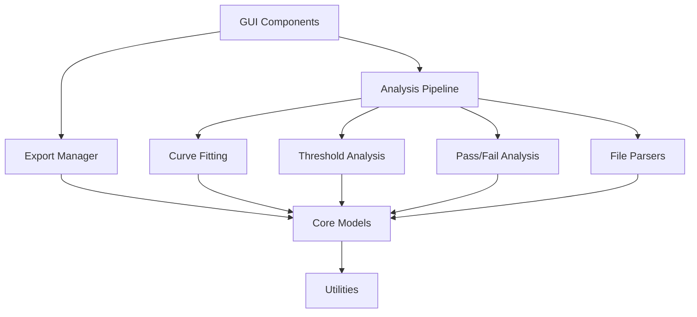

# Technical Documentation - Fluorescence Data Analysis Tool

Comprehensive technical reference for developers working with the simplified fluorescence analysis tool.

## Table of Contents

1. [Architecture Overview](#architecture-overview)
2. [Module Structure](#module-structure)
3. [Core Data Models](#core-data-models)
4. [API Reference](#api-reference)
5. [File Format Parsers](#file-format-parsers)
6. [Analysis Algorithms](#analysis-algorithms)
7. [GUI Components](#gui-components)
8. [Testing Framework](#testing-framework)
9. [Development Guidelines](#development-guidelines)
10. [Performance Considerations](#performance-considerations)

---

## Architecture Overview

The fluorescence analysis tool follows a clean, modular architecture designed for maintainability and extensibility.

### Design Principles

**Separation of Concerns**
- GUI components handle only user interface logic
- Core modules manage business logic and data processing
- Parsers handle file format specifics
- Algorithms focus on mathematical computations

**Dependency Management**
- Clear dependency hierarchy with minimal circular dependencies
- Core modules are independent of GUI components
- Parsers are interchangeable through common interfaces
- Algorithms can be used independently of the GUI

**Error Handling Strategy**
- Graceful degradation with user-friendly error messages
- Comprehensive logging for debugging
- Input validation at module boundaries
- Recovery mechanisms for common failure scenarios

### High-Level Architecture

```
┌─────────────────────────────────────────────────────────────┐
│                    GUI Layer (tkinter)                     │
│  ┌─────────────────┐  ┌─────────────────┐  ┌─────────────┐ │
│  │  Main Window    │  │  Plate View     │  │ Plot Panel  │ │
│  │  File Loader    │  │  Components     │  │ Components  │ │
│  └─────────────────┘  └─────────────────┘  └─────────────┘ │
├─────────────────────────────────────────────────────────────┤
│                 Application Logic Layer                    │
│  ┌─────────────────┐  ┌─────────────────┐  ┌─────────────┐ │
│  │  Analysis       │  │  Export         │  │ Pass/Fail   │ │
│  │  Pipeline       │  │  Manager        │  │ Analysis    │ │
│  └─────────────────┘  └─────────────────┘  └─────────────┘ │
├─────────────────────────────────────────────────────────────┤
│                 Data Processing Layer                      │
│  ┌─────────────────┐  ┌─────────────────┐  ┌─────────────┐ │
│  │  File Parsers   │  │  Curve Fitting  │  │ Threshold   │ │
│  │  (BMG/BioRad)   │  │  Algorithms     │  │ Analysis    │ │
│  └─────────────────┘  └─────────────────┘  └─────────────┘ │
├─────────────────────────────────────────────────────────────┤
│                    Core Data Layer                         │
│  ┌─────────────────┐  ┌─────────────────┐  ┌─────────────┐ │
│  │  Data Models    │  │  Validation     │  │ Utilities   │ │
│  │  (Dataclasses)  │  │  Functions      │  │ & Helpers   │ │
│  └─────────────────┘  └─────────────────┘  └─────────────┘ │
└─────────────────────────────────────────────────────────────┘
```

---

## Module Structure

### Project Organization

```
fluorescence_tool/
├── __init__.py                 # Package initialization
├── gui/                       # User interface components
│   ├── __init__.py
│   ├── main_window.py         # Main application window
│   └── components/            # Reusable GUI components
│       ├── __init__.py
│       ├── file_loader.py     # File loading interface
│       ├── plate_view.py      # Interactive plate visualization
│       ├── plot_panel.py      # Plot display and controls
│       └── dialogs.py         # Export and settings dialogs
├── core/                      # Core business logic
│   ├── __init__.py
│   ├── models.py              # Data structures and models
│   └── export_manager.py      # File export functionality
├── parsers/                   # File format parsers
│   ├── __init__.py
│   ├── bmg_parser.py          # BMG Omega3 format parser
│   ├── biorad_parser.py       # BioRad format parser
│   └── layout_parser.py       # Layout file parser
├── algorithms/                # Analysis algorithms
│   ├── __init__.py
│   ├── curve_fitting.py       # 5-parameter sigmoid fitting
│   ├── threshold_analysis.py  # Threshold detection
│   ├── pass_fail_analysis.py  # Pass/fail evaluation
│   ├── statistical_analysis.py # Statistical calculations
│   └── analysis_pipeline.py   # Complete analysis workflow
└── utils/                     # Utility functions
    ├── __init__.py
    ├── time_utils.py          # Time conversion utilities
    └── validators.py          # Data validation functions
```

### Module Dependencies



---

## Core Data Models

The tool uses well-defined data structures to ensure type safety and clear interfaces between components.

### Primary Data Models

#### FluorescenceData

The central data structure for normalized fluorescence measurements.

```python
@dataclass
class FluorescenceData:
    """
    Normalized fluorescence data structure for both file formats.
    
    This class represents processed fluorescence data in a standardized format,
    regardless of the original file format (BMG Omega3 or BioRad).
    """
    time_points: List[float]        # Time values in hours
    wells: List[str]                # Well identifiers (A1, A2, etc.)
    measurements: np.ndarray        # Raw fluorescence values [wells x timepoints]
    metadata: Dict[str, Any]        # File format, instrument info, etc.
    format_type: FileFormat         # Source file format
    
    def __post_init__(self):
        """Validate data consistency after initialization."""
        if len(self.wells) != self.measurements.shape[0]:
            raise ValueError("Number of wells must match measurement rows")
        if len(self.time_points) != self.measurements.shape[1]:
            raise ValueError("Number of time points must match measurement columns")
```

**Key Features:**
- **Type Safety**: Clear type hints for all fields
- **Validation**: Automatic consistency checking
- **Format Agnostic**: Works with both BMG and BioRad data
- **Numpy Integration**: Efficient array storage for measurements

#### WellInfo

Layout and metadata information for individual wells.

```python
@dataclass
class WellInfo:
    """
    Well layout information from layout file.
    
    Contains metadata about each well including sample information,
    well type classification, and grouping for analysis.
    """
    well_id: str                    # A1, B2, etc.
    plate_id: str                   # From layout file
    sample: str                     # Sample identifier
    well_type: str                  # sample, neg_cntrl, unused, etc.
    cell_count: Optional[int]       # Number of cells/capsules
    group_1: Optional[str]          # Primary grouping
    group_2: Optional[str]          # Secondary grouping
    group_3: Optional[str]          # Tertiary grouping
```

**Well Type Classifications:**
- `sample`: Experimental samples
- `neg_cntrl`: Negative controls
- `pos_cntrl`: Positive controls
- `unused`: Wells not part of experiment
- `blank`: Empty wells or buffer only

#### PassFailResult

Pass/fail analysis results with detailed criteria evaluation.

```python
@dataclass
class PassFailResult:
    """
    Pass/fail analysis result for a single well.
    
    Contains the pass/fail determination based on threshold criteria
    and the values used for the determination.
    """
    well_id: str
    passed: bool                       # True if well passed, False if failed
    cp_value: Optional[float]          # Crossing point value used (hours)
    fluorescence_change_value: Optional[float] # Fluorescence change value used
    cp_passed: bool                    # Whether CP criterion was met
    fluorescence_change_passed: bool   # Whether fluorescence change criterion was met
    analysis_available: bool           # Whether analysis results were available
    failure_reason: Optional[str]      # Reason for failure if applicable
```

### Enumeration Types

#### FileFormat

Supported file format identification.

```python
class FileFormat(Enum):
    """Supported file formats for fluorescence data."""
    BMG_OMEGA3 = "bmg_omega3"
    BIORAD = "biorad"
    UNKNOWN = "unknown"
```

### Data Validation

#### Input Validation

All data models include validation to ensure data integrity:

```python
def validate_fluorescence_data(data: FluorescenceData) -> List[str]:
    """
    Comprehensive validation of fluorescence data.
    
    Returns:
        List of validation warnings/errors
    """
    issues = []
    
    # Basic structure validation
    if len(data.time_points) != data.measurements.shape[1]:
        issues.append("Time points and measurements must have same length")
    
    if len(data.wells) != data.measurements.shape[0]:
        issues.append("Number of wells must match measurement rows")
    
    # Data quality validation
    if np.any(np.isnan(data.measurements)):
        issues.append("NaN values detected in measurements")
    
    if np.any(data.measurements < 0):
        issues.append("Negative fluorescence values detected")
    
    # Time progression check
    if not np.all(np.diff(data.time_points) > 0):
        issues.append("Time points must be in ascending order")
    
    return issues
```

#### Well ID Validation

```python
def validate_well_id(well_id: str) -> bool:
    """
    Validate well ID format (e.g., A1, B12, P24).
    
    Args:
        well_id: Well identifier string
        
    Returns:
        True if valid format, False otherwise
    """
    import re
    pattern = r'^[A-P][1-9][0-9]?$|^[A-P][1-2][0-4]$'
    return bool(re.match(pattern, well_id))
```

### Data Transformation Utilities

#### Time Conversion

```python
def convert_time_to_hours(time_str: str) -> float:
    """
    Convert BMG time format to decimal hours.
    
    Supports formats:
    - "1 h 30 min" → 1.5 hours
    - "2 h" → 2.0 hours
    - "45 min" → 0.75 hours
    
    Args:
        time_str: Time string in BMG format
        
    Returns:
        Time in decimal hours
        
    Raises:
        ValueError: If format is not recognized
    """
    import re
    
    # Full pattern (hours with optional minutes)
    full_pattern = r'^(\d+)\s*h(?:\s*(\d+)\s*min)?$'
    match = re.match(full_pattern, time_str.strip())
    if match:
        hours = int(match.group(1))
        minutes = int(match.group(2)) if match.group(2) else 0
        return hours + (minutes / 60.0)
    
    # Minutes-only pattern
    min_pattern = r'^(\d+)\s*min$'
    match = re.match(min_pattern, time_str.strip())
    if match:
        minutes = int(match.group(1))
        return minutes / 60.0
    
    raise ValueError(f"Invalid time format: '{time_str}'")
```

#### Data Normalization

```python
def normalize_well_measurements(measurements: np.ndarray,
                               method: str = "baseline") -> np.ndarray:
    """
    Normalize fluorescence measurements.
    
    Args:
        measurements: Raw fluorescence values
        method: Normalization method ("baseline", "zscore", "minmax")
        
    Returns:
        Normalized measurements
    """
    if method == "baseline":
        # Normalize to first time point
        baseline = measurements[0]
        return measurements / baseline if baseline > 0 else measurements
    
    elif method == "zscore":
        # Z-score normalization
        mean_val = np.mean(measurements)
        std_val = np.std(measurements)
        return (measurements - mean_val) / std_val if std_val > 0 else measurements
    
    elif method == "minmax":
        # Min-max normalization
        min_val = np.min(measurements)
        max_val = np.max(measurements)
        range_val = max_val - min_val
        return (measurements - min_val) / range_val if range_val > 0 else measurements
    
    else:
        raise ValueError(f"Unknown normalization method: {method}")
```

### Error Handling

#### Custom Exceptions

```python
class FluorescenceAnalysisError(Exception):
    """Base exception for fluorescence analysis errors."""
    pass

class FileFormatError(FluorescenceAnalysisError):
    """Raised when file format is invalid or unsupported."""
    pass

class DataValidationError(FluorescenceAnalysisError):
    """Raised when data validation fails."""
    pass

class CurveFittingError(FluorescenceAnalysisError):
    """Raised when curve fitting fails."""
    pass

class ThresholdAnalysisError(FluorescenceAnalysisError):
    """Raised when threshold analysis fails."""
    pass
```

#### Error Context Management

```python
from contextlib import contextmanager
from typing import Generator

@contextmanager
def analysis_context(operation: str) -> Generator[None, None, None]:
    """
    Context manager for analysis operations with error handling.
    
    Args:
        operation: Description of the operation being performed
    """
    try:
        yield
    except Exception as e:
        error_msg = f"Error during {operation}: {str(e)}"
        raise FluorescenceAnalysisError(error_msg) from e
```

---

## API Reference

### Analysis Pipeline

The main entry point for programmatic analysis.

#### FluorescenceAnalysisPipeline

```python
class FluorescenceAnalysisPipeline:
    """
    Complete analysis pipeline for fluorescence data.
    
    Coordinates file parsing, curve fitting, threshold analysis,
    and pass/fail evaluation in a single workflow.
    """
    
    def __init__(self):
        """Initialize the analysis pipeline."""
        self.bmg_parser = BMGOmega3Parser()
        self.biorad_parser = BioRadParser()
        self.layout_parser = LayoutParser()
        self.curve_fitter = CurveFitter()
        self.threshold_analyzer = ThresholdAnalyzer()
        self.pass_fail_analyzer = PassFailAnalyzer()
    
    def analyze_files(self,
                     data_file_path: str,
                     layout_file_path: str,
                     cycle_time_minutes: Optional[float] = None) -> Dict[str, Any]:
        """
        Perform complete analysis on fluorescence data files.
        
        Args:
            data_file_path: Path to fluorescence data file
            layout_file_path: Path to layout CSV file
            cycle_time_minutes: Cycle time for BioRad files (optional)
            
        Returns:
            Dictionary containing complete analysis results
            
        Raises:
            FileFormatError: If file format is not supported
            DataValidationError: If data validation fails
            CurveFittingError: If curve fitting fails
        """
        # Implementation details...
        pass
```

### Usage Examples

#### Basic Analysis Workflow

```python
from fluorescence_tool.algorithms.analysis_pipeline import FluorescenceAnalysisPipeline

# Initialize pipeline
pipeline = FluorescenceAnalysisPipeline()

# Analyze files
results = pipeline.analyze_files(
    data_file_path="data/RM5097.96HL.BNCT.1.CSV",
    layout_file_path="data/RM5097_layout.csv"
)

# Access results
curve_fits = results['curve_fits']
pass_fail_results = results['pass_fail_results']
summary_stats = results['summary_statistics']
```

---

## Testing Framework

### Test Structure

The tool includes comprehensive testing at multiple levels:

```
tests/
├── __init__.py
├── unit/                          # Unit tests
│   ├── __init__.py
│   ├── test_models.py            # Data model tests
│   ├── test_algorithms/          # Algorithm tests
│   │   ├── test_curve_fitting.py
│   │   ├── test_threshold_analysis.py
│   │   └── test_pass_fail_analysis.py
│   └── test_parsers/             # Parser tests
│       ├── test_bmg_parser.py
│       ├── test_biorad_parser.py
│       └── test_layout_parser.py
├── integration/                   # Integration tests
│   ├── __init__.py
│   └── test_analysis_pipeline.py
└── performance/                   # Performance tests
    ├── __init__.py
    └── test_large_datasets.py
```

### Running Tests

```bash
# Run all tests
pytest tests/ -v

# Run specific test categories
pytest tests/unit/ -v              # Unit tests only
pytest tests/integration/ -v       # Integration tests only
pytest tests/performance/ -v       # Performance tests only

# Run with coverage
pytest tests/ --cov=fluorescence_tool --cov-report=html

# Run specific test file
pytest tests/unit/test_models.py -v
```

### Test Examples

#### Unit Test Example

```python
import pytest
import numpy as np
from fluorescence_tool.core.models import FluorescenceData, FileFormat

class TestFluorescenceData:
    """Test FluorescenceData model validation."""
    
    def test_valid_data_creation(self):
        """Test creating valid FluorescenceData object."""
        time_points = [0.0, 0.25, 0.5, 0.75, 1.0]
        wells = ["A1", "A2", "B1"]
        measurements = np.array([
            [100, 110, 120, 130, 140],  # A1
            [200, 210, 220, 230, 240],  # A2
            [300, 310, 320, 330, 340]   # B1
        ])
        metadata = {"instrument": "BMG", "user": "test"}
        
        data = FluorescenceData(
            time_points=time_points,
            wells=wells,
            measurements=measurements,
            metadata=metadata,
            format_type=FileFormat.BMG_OMEGA3
        )
        
        assert len(data.wells) == 3
        assert len(data.time_points) == 5
        assert data.measurements.shape == (3, 5)
    
    def test_invalid_dimensions_raises_error(self):
        """Test that mismatched dimensions raise ValueError."""
        time_points = [0.0, 0.25, 0.5]  # 3 time points
        wells = ["A1", "A2"]             # 2 wells
        measurements = np.array([
            [100, 110, 120, 130],        # 4 measurements - mismatch!
            [200, 210, 220, 230]
        ])
        
        with pytest.raises(ValueError, match="Time points and measurements"):
            FluorescenceData(
                time_points=time_points,
                wells=wells,
                measurements=measurements,
                metadata={},
                format_type=FileFormat.BMG_OMEGA3
            )
```

#### Integration Test Example

```python
import pytest
from pathlib import Path
from fluorescence_tool.algorithms.analysis_pipeline import FluorescenceAnalysisPipeline

class TestAnalysisPipeline:
    """Test complete analysis pipeline with real data."""
    
    @pytest.fixture
    def sample_files(self):
        """Provide paths to sample data files."""
        return {
            'bmg_data': 'test_data/RM5097.96HL.BNCT.1.CSV',
            'layout': 'test_data/Killer_plate_1.csv'  # New format with required Sample column
        }
    
    def test_complete_bmg_analysis(self, sample_files):
        """Test complete analysis workflow with BMG data."""
        pipeline = FluorescenceAnalysisPipeline()
        
        results = pipeline.analyze_files(
            data_file_path=sample_files['bmg_data'],
            layout_file_path=sample_files['layout']
        )
        
        # Verify results structure
        assert 'fluorescence_data' in results
        assert 'layout_data' in results
        assert 'curve_fits' in results
        assert 'pass_fail_results' in results
        
        # Verify data quality
        fluorescence_data = results['fluorescence_data']
        assert len(fluorescence_data.wells) > 0
        assert len(fluorescence_data.time_points) > 5
        
        # Verify analysis results
        curve_fits = results['curve_fits']
        assert len(curve_fits) > 0
        
        # Check that some wells have successful fits
        successful_fits = [r for r in curve_fits.values() if r.success]
        assert len(successful_fits) > 0
```

### Performance Testing

```python
import pytest
import time
import numpy as np
from fluorescence_tool.algorithms.curve_fitting import CurveFitter

class TestPerformance:
    """Performance tests for critical components."""
    
    def test_curve_fitting_performance(self):
        """Test curve fitting performance with large dataset."""
        fitter = CurveFitter()
        
        # Generate synthetic data
        time_points = np.linspace(0, 24, 100)  # 100 time points
        measurements = self._generate_sigmoid_data(time_points)
        
        # Measure fitting time
        start_time = time.time()
        result = fitter.fit_curve(time_points, measurements, "test_well")
        end_time = time.time()
        
        # Performance assertions
        fitting_time = end_time - start_time
        assert fitting_time < 2.0, f"Curve fitting took {fitting_time:.2f}s, expected < 2.0s"
        assert result.success, "Curve fitting should succeed with synthetic data"
        assert result.r_squared > 0.95, "Synthetic data should fit very well"
    
    def _generate_sigmoid_data(self, time_points):
        """Generate synthetic sigmoid data for testing."""
        # 5-parameter sigmoid: y = a / (1 + exp(-b * (x - c))) + d + e * x
        a, b, c, d, e = 1000, 1.5, 12, 500, 0.1
        noise_level = 10
        
        y = a / (1 + np.exp(-b * (time_points - c))) + d + e * time_points
        noise = np.random.normal(0, noise_level, len(time_points))
        return y + noise
```

---

## Development Guidelines

### Code Style and Standards

#### Python Style Guide

Follow PEP 8 with these specific guidelines:

```python
# Good: Clear function names and type hints
def calculate_crossing_point(time_points: np.ndarray,
                           fitted_curve: np.ndarray,
                           threshold: float) -> Optional[float]:
    """
    Calculate threshold crossing point using linear interpolation.
    
    Args:
        time_points: Time values in hours
        fitted_curve: Fitted fluorescence values
        threshold: Threshold value to cross
        
    Returns:
        Crossing time in hours, or None if no crossing found
    """
    # Implementation...
    pass

# Good: Descriptive variable names
baseline_fluorescence = np.mean(measurements[:3])
threshold_value = baseline_fluorescence * 1.10

# Good: Clear error handling
try:
    result = curve_fitter.fit_curve(time_points, measurements, well_id)
except CurveFittingError as e:
    logger.warning(f"Curve fitting failed for well {well_id}: {e}")
    return None
```

#### Documentation Standards

```python
class CurveFitter:
    """
    5-parameter sigmoid curve fitting with adaptive strategy.
    
    This class implements robust curve fitting using multiple strategies
    and timeout protection to handle various data patterns reliably.
    
    Attributes:
        timeout_seconds: Maximum time allowed per fit attempt
        max_iterations: Maximum optimization iterations
        
    Example:
        >>> fitter = CurveFitter(timeout_seconds=2)
        >>> result = fitter.fit_curve(time_points, measurements, "A1")
        >>> print(f"R-squared: {result.r_squared:.3f}")
    """
    
    def fit_curve(self, time_points: np.ndarray, measurements: np.ndarray,
                  well_id: str) -> CurveFitResult:
        """
        Fit 5-parameter sigmoid curve using adaptive strategy.
        
        The method tries multiple fitting strategies in order of preference:
        1. Standard fit with typical parameter bounds
        2. Steep curve fit for rapid growth patterns
        3. Wide range fit for unusual parameter ranges
        
        Args:
            time_points: Time values in hours (must be ascending)
            measurements: Fluorescence measurements (same length as time_points)
            well_id: Well identifier for result tracking and error messages
            
        Returns:
            CurveFitResult containing fitted parameters and quality metrics
            
        Raises:
            CurveFittingError: If all fitting strategies fail
            ValueError: If input data is invalid
            
        Note:
            Each fitting attempt is limited by timeout_seconds to prevent
            hanging on problematic data.
        """
        # Implementation...
        pass
```

### Error Handling Patterns

#### Graceful Degradation

```python
def analyze_well_with_fallback(well_id: str, time_points: np.ndarray,
                              measurements: np.ndarray) -> Optional[CurveFitResult]:
    """
    Analyze well with graceful degradation on failure.
    
    Tries multiple approaches and provides partial results when possible.
    """
    try:
        # Primary analysis method
        return primary_curve_fitting(time_points, measurements, well_id)
    
    except CurveFittingError:
        try:
            # Fallback to simpler model
            logger.info(f"Primary fitting failed for {well_id}, trying fallback")
            return fallback_curve_fitting(time_points, measurements, well_id)
        
        except Exception as e:
            # Log error but don't crash
            logger.error(f"All fitting methods failed for {well_id}: {e}")
            return None
```

#### User-Friendly Error Messages

```python
def create_user_friendly_error(error: Exception, context: str) -> str:
    """
    Convert technical errors to user-friendly messages.
    
    Args:
        error: Original exception
        context: Context where error occurred
        
    Returns:
        User-friendly error message
    """
    error_messages = {
        FileNotFoundError: "The selected file could not be found. Please check the file path.",
        PermissionError: "Permission denied. Please check file permissions or try running as administrator.",
        UnicodeDecodeError: "File encoding issue. Please save the file as UTF-8 and try again.",
        ValueError: "Invalid data format. Please check that your file matches the expected format.",
        CurveFittingError: "Curve fitting failed. This may indicate insufficient data or unusual patterns."
    }
    
    error_type = type(error)
    base_message = error_messages.get(error_type, "An unexpected error occurred.")
    
    return f"{base_message}\n\nContext: {context}\nTechnical details: {str(error)}"
```

### Performance Optimization

#### Efficient Data Processing

```python
# Good: Vectorized operations
def calculate_thresholds_vectorized(measurements: np.ndarray,
                                  baseline_percentage: float = 10.0) -> np.ndarray:
    """Calculate thresholds for all wells using vectorized operations."""
    # Calculate baselines for all wells at once
    baselines = np.mean(measurements[:, 1:4], axis=1)  # Use points 1-3
    
    # Calculate thresholds vectorized
    thresholds = baselines * (1 + baseline_percentage / 100.0)
    
    return thresholds

# Avoid: Loop-based processing
def calculate_thresholds_slow(measurements: np.ndarray,
                            baseline_percentage: float = 10.0) -> np.ndarray:
    """Slow version using loops (avoid this pattern)."""
    thresholds = []
    for well_measurements in measurements:
        baseline = np.mean(well_measurements[1:4])
        threshold = baseline * (1 + baseline_percentage / 100.0)
        thresholds.append(threshold)
    return np.array(thresholds)
```

#### Memory Management

```python
def process_large_dataset(file_path: str, chunk_size: int = 1000) -> Iterator[Dict[str, Any]]:
    """
    Process large datasets in chunks to manage memory usage.
    
    Args:
        file_path: Path to large data file
        chunk_size: Number of wells to process at once
        
    Yields:
        Analysis results for each chunk
    """
    # Load data in chunks
    for chunk_start in range(0, total_wells, chunk_size):
        chunk_end = min(chunk_start + chunk_size, total_wells)
        
        # Process chunk
        chunk_data = load_data_chunk(file_path, chunk_start, chunk_end)
        chunk_results = analyze_chunk(chunk_data)
        
        yield chunk_results
        
        # Explicit cleanup
        del chunk_data
        del chunk_results
```

### Logging and Debugging

#### Structured Logging

```python
import logging
from typing import Any, Dict

# Configure logging
logging.basicConfig(
    level=logging.INFO,
    format='%(asctime)s - %(name)s - %(levelname)s - %(message)s',
    handlers=[
        logging.FileHandler('fluorescence_analysis.log'),
        logging.StreamHandler()
    ]
)

logger = logging.getLogger(__name__)

def log_analysis_start(well_id: str, data_points: int) -> None:
    """Log analysis start with context."""
    logger.info(f"Starting analysis for well {well_id} with {data_points} data points")

def log_analysis_result(well_id: str, result: CurveFitResult) -> None:
    """Log analysis results with key metrics."""
    if result.success:
        logger.info(f"Well {well_id}: R² = {result.r_squared:.3f}, "
                   f"strategy = {result.strategy_used}")
    else:
        logger.warning(f"Well {well_id}: Analysis failed - {result.error_message}")

def log_performance_metrics(operation: str, duration: float, data_size: int) -> None:
    """Log performance metrics for optimization."""
    rate = data_size / duration if duration > 0 else 0
    logger.info(f"Performance: {operation} took {duration:.2f}s "
               f"for {data_size} items ({rate:.1f} items/sec)")
```

---

## Performance Considerations

### Optimization Strategies

#### Algorithm Performance

**Curve Fitting Optimization**
- Use timeout protection to prevent hanging on difficult data
- Implement multiple fitting strategies with early termination
- Cache successful parameter estimates for similar data patterns
- Use efficient initial parameter estimation

**Memory Usage**
- Process data in chunks for large datasets (>1000 wells)
- Use numpy arrays for efficient numerical operations
- Implement lazy loading for file parsing
- Clear intermediate results when no longer needed

#### GUI Performance

**Responsive Interface**
- Use threading for long-running operations
- Implement progress indicators for user feedback
- Update GUI incrementally during processing
- Avoid blocking the main thread

**Plot Performance**
- Limit number of simultaneously displayed curves
- Use data decimation for very dense time series
- Implement efficient plot updates (only redraw changed elements)
- Cache plot elements when possible

### Scalability Limits

#### Current Limitations

**Data Size Limits**
- Maximum wells: 384 (standard plate format)
- Maximum time points: 500 per well
- Maximum file size: 100MB
- Memory usage: <2GB for typical datasets

**Performance Targets**
- Curve fitting: <0.01 seconds per well (two-path approach)
- Full 96-well plate analysis: <1 second total
- File loading: <10 seconds for 384-well plate
- GUI responsiveness: <100ms for user interactions
- Export operations: <30 seconds for complete analysis

#### Scaling Strategies

**For Larger Datasets**
```python
def analyze_large_dataset(data_file: str, layout_file: str,
                         batch_size: int = 96) -> Iterator[Dict[str, Any]]:
    """
    Analyze large datasets using batch processing.
    
    Args:
        data_file: Path to fluorescence data
        layout_file: Path to layout file
        batch_size: Number of wells per batch
        
    Yields:
        Analysis results for each batch
    """
    # Load layout once
    layout_data = LayoutParser().parse_file(layout_file)
    
    # Process data in batches
    for batch_wells in chunk_wells(layout_data.keys(), batch_size):
        batch_data = load_wells_subset(data_file, batch_wells)
        batch_results = analyze_batch(batch_data, layout_data)
        yield batch_results
```

**Memory Optimization**
```python
def optimize_memory_usage():
    """Best practices for memory optimization."""
    
    # Use generators for large datasets
    def process_wells_generator(wells_data):
        for well_id, measurements in wells_data.items():
            result = analyze_well(well_id, measurements)
            yield result
            # Memory is freed after each yield
    
    # Explicit cleanup
    def cleanup_analysis_data(analysis_results):
        """Clean up large data structures."""
        for result in analysis_results.values():
            if hasattr(result, 'fitted_curve'):
                del result.fitted_curve  # Remove large arrays
        
    # Use context managers
    with analysis_context("batch_processing"):
        results = process_batch(data)
        export_results(results)
        # Automatic cleanup on context exit
```

---

*This completes the comprehensive Technical Documentation for the Fluorescence Data Analysis Tool. For user instructions, see [USER_GUIDE.md](USER_GUIDE.md). For algorithm details, see [ALGORITHM_DOCUMENTATION.md](ALGORITHM_DOCUMENTATION.md).*