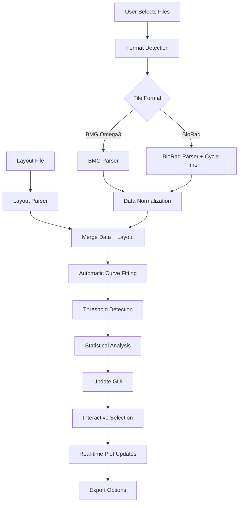

# Simplified Fluorescence Data Analysis Tool - Architecture Design

## Executive Summary

This document outlines the architecture for a simplified, reliable fluorescence data analysis tool that replaces the current over-engineered system. The new tool is designed as a single desktop application with minimal dependencies, focusing on core functionality and user workflow efficiency.

## 1. System Overview

### 1.1 Design Philosophy
- **Simplicity First**: Single desktop application, no web interfaces, databases, or microservices
- **Reliability**: Robust file processing with sensible defaults
- **User-Centric**: Workflow designed around actual scientist usage patterns
- **Minimal Dependencies**: Scientific Python stack only, managed via conda environment
- **Real-time Interactivity**: Immediate visual feedback for all user actions

### 1.2 Core Functionality
- Dual-format file processing (BMG Omega3 .csv, BioRad .txt)
- Automatic sigmoid curve fitting with baseline percentage threshold detection
- Interactive plate visualization with dynamic well selection
- Real-time plot updates based on user selections
- Flexible grouping and color-coding system
- Publication-ready plot exports and comprehensive data analysis

## 2. Technology Stack

### 2.1 Core Technologies
- **Language**: Python 3.9+
- **GUI Framework**: tkinter (built-in, no external dependencies) with ttk for modern widgets
- **Scientific Computing**: NumPy, SciPy, Pandas
- **Visualization**: Matplotlib with tkinter backend
- **Data Processing**: Built-in CSV/text parsing
- **Environment Management**: Conda

### 2.2 Dependency Specification
```yaml
# environment.yml
name: fluorescence-tool
channels:
  - conda-forge
  - defaults
dependencies:
  - python=3.9
  - numpy=1.24
  - scipy=1.10
  - pandas=2.0
  - matplotlib=3.7
  - pip
  - pip:
    - matplotlib-backend-tkagg
```

### 2.3 Rationale for Technology Choices
- **tkinter**: Native Python GUI, no installation issues, cross-platform
- **Matplotlib**: Industry standard for scientific plotting, excellent PDF export
- **NumPy/SciPy**: Proven scientific computing libraries
- **Pandas**: Efficient data manipulation and CSV handling
- **Conda**: Reliable environment isolation and dependency management

## 3. System Architecture

### 3.1 High-Level Architecture

```
┌─────────────────────────────────────────────────────────────┐
│                    Fluorescence Analysis Tool               │
├─────────────────────────────────────────────────────────────┤
│  GUI Layer (tkinter)                                       │
│  ┌─────────────────┐  ┌─────────────────┐  ┌─────────────┐ │
│  │  File Loader    │  │  Plate View     │  │ Plot Panel  │ │
│  │  Component      │  │  Component      │  │ Component   │ │
│  └─────────────────┘  └─────────────────┘  └─────────────┘ │
├─────────────────────────────────────────────────────────────┤
│  Application Logic Layer                                   │
│  ┌─────────────────┐  ┌─────────────────┐  ┌─────────────┐ │
│  │  Data Manager   │  │  Analysis       │  │ Export      │ │
│  │                 │  │  Engine         │  │ Manager     │ │
│  └─────────────────┘  └─────────────────┘  └─────────────┘ │
├─────────────────────────────────────────────────────────────┤
│  Data Processing Layer                                     │
│  ┌─────────────────┐  ┌─────────────────┐  ┌─────────────┐ │
│  │  File Parsers   │  │  Curve Fitting  │  │ Statistics  │ │
│  │  (BMG/BioRad)   │  │  Algorithms     │  │ Calculator  │ │
│  └─────────────────┘  └─────────────────┘  └─────────────┘ │
└─────────────────────────────────────────────────────────────┘
```

### 3.2 Module Structure

```
fluorescence_tool/
├── main.py                 # Application entry point
├── environment.yml         # Conda environment specification
├── gui/
│   ├── __init__.py
│   ├── main_window.py     # Main application window
│   ├── file_loader.py     # File loading interface
│   ├── plate_view.py      # Interactive plate visualization
│   ├── plot_panel.py      # Plot display and controls
│   └── dialogs.py         # Export and settings dialogs
├── core/
│   ├── __init__.py
│   ├── data_manager.py    # Central data management
│   ├── analysis_engine.py # Curve fitting and analysis
│   └── export_manager.py  # File export functionality
├── parsers/
│   ├── __init__.py
│   ├── base_parser.py     # Abstract base parser
│   ├── bmg_parser.py      # BMG Omega3 format parser
│   ├── biorad_parser.py   # BioRad format parser
│   └── layout_parser.py   # Layout file parser
├── algorithms/
│   ├── __init__.py
│   ├── curve_fitting.py   # Sigmoid curve fitting
│   ├── threshold.py       # Threshold detection
│   └── statistics.py      # Statistical calculations
└── utils/
    ├── __init__.py
    ├── validators.py      # Data validation utilities
    └── constants.py       # Application constants
```

## 4. Data Flow Design

### 4.1 Data Processing Pipeline



### 4.2 Data Models

#### 4.2.1 Core Data Structures
```python
@dataclass
class FluorescenceData:
    """Normalized fluorescence data structure"""
    time_points: np.ndarray      # Time values (hours)
    wells: List[str]             # Well identifiers (A1, A2, etc.)
    measurements: np.ndarray     # Raw fluorescence values [wells x timepoints]
    metadata: Dict[str, Any]     # File format, instrument info, etc.

@dataclass
class WellInfo:
    """Well layout information"""
    well_id: str                 # A1, B2, etc.
    plate_id: str               # From layout file
    sample: str                 # Sample identifier
    well_type: str              # sample, neg_cntrl, unused, etc.
    cell_count: Optional[int]   # Number of cells/capsules
    group_1: Optional[str]      # Primary grouping
    group_2: Optional[str]      # Secondary grouping  
    group_3: Optional[str]      # Tertiary grouping

@dataclass
class CurveFitResult:
    """Curve fitting analysis results"""
    well_id: str
    fitted_params: np.ndarray   # Sigmoid parameters [a, b, c, d, g]
    fitted_curve: np.ndarray    # Fitted y-values
    r_squared: float            # Goodness of fit
    crossing_point: float       # Time at threshold crossing
    threshold_value: float      # Fluorescence threshold
    delta_fluorescence: float   # End - Start fluorescence
    fit_quality: str           # "excellent", "good", "poor"
```

### 4.3 File Format Handling

#### 4.3.1 BMG Omega3 Format (.csv)
- **Time Header Parsing**: Convert "2 h 30 min" → 2.5 hours
- **Well Identification**: Extract from "Well Row", "Well Col" columns
- **Data Extraction**: Fluorescence values from time-series columns
- **Automatic Processing**: No user input required

#### 4.3.2 BioRad Format (.txt)
- **Cycle-based Data**: Requires user-provided cycle time (minutes)
- **Data Transposition**: Convert cycle-based to time-series format
- **Time Calculation**: Cycle number × cycle time → hours
- **Well Mapping**: Direct well ID extraction (A1, A2, etc.)

#### 4.3.3 Layout File Format (.csv)
```csv
Plate_ID,Well_Row,Well_Col,Well,Sample,Type,number_of_cells/capsules,Group_1,Group_2,Group_3
RM5097,A,1,A1,Sample1,sample,100,Rep1,BONCAT,
RM5097,A,2,A2,,unused,,,,
RM5097,B,1,B1,Control1,neg_cntrl,0,sheath,,
```

## 5. GUI Design and User Interface

### 5.1 Main Window Layout

```
┌─────────────────────────────────────────────────────────────────────┐
│ Fluorescence Analysis Tool                                    [_][□][×]│
├─────────────────────────────────────────────────────────────────────┤
│ File Loading Panel                                                  │
│ [Load Data File] [Load Layout File] [Process] [Status: Ready]       │
├─────────────────────────────────────────────────────────────────────┤
│                                    │                                │
│  Plate View (Left Pane)           │  Plot Panel (Right Pane)       │
│                                    │                                │
│  ┌─────────────────────────────┐   │  ┌─────────────────────────────┐│
│  │    Interactive Plate       │   │  │     Time-Series Plot        ││
│  │                             │   │  │                             ││
│  │  A1  A2  A3  A4  A5  A6    │   │  │                             ││
│  │  B1  B2  B3  B4  B5  B6    │   │  │                             ││
│  │  C1  C2  C3  C4  C5  C6    │   │  │                             ││
│  │  ...                        │   │  │                             ││
│  │                             │   │  │                             ││
│  │  Color Legend:              │   │  └─────────────────────────────┘│
│  │  ■ Sample  ■ Control        │   │                                │
│  │  ■ Unused  ■ Selected       │   │  Grouping Controls:            │
│  └─────────────────────────────┘   │  ☑ Type  ☑ Group_1            │
│                                    │  ☐ Group_2  ☐ Group_3         │
│  Selection Info:                   │                                │
│  Wells: A1, A2, B3 (3 selected)   │  [Export Plot] [Export Data]   │
│                                    │                                │
└─────────────────────────────────────────────────────────────────────┘
```

### 5.2 Interactive Components

#### 5.2.1 Plate View Component
- **Visual Representation**: 96-well or 384-well plate layout
- **Color Coding**: Wells colored by Type and Group combinations
- **Selection Interface**: Click to select/deselect wells, drag for multi-select
- **Real-time Updates**: Selection changes immediately update plot
- **Legend**: Dynamic legend showing current color scheme

#### 5.2.2 Plot Panel Component
- **Matplotlib Integration**: Embedded matplotlib canvas with tkinter backend
- **Curve Display**: Time-series curves for selected wells only
- **Automatic Scaling**: Axes auto-scale based on selected data
- **Curve Fitting Overlay**: Fitted sigmoid curves displayed with raw data
- **Interactive Features**: Zoom, pan, cursor readouts

#### 5.2.3 Grouping Controls
- **Dynamic Checkboxes**: Generated based on available groups in layout
- **Real-time Color Updates**: Checking/unchecking immediately updates plate colors
- **Combination Logic**: Multiple groups create combined color schemes
- **Clear Selection**: Button to clear all selections

### 5.3 User Interaction Flow

1. **File Loading**:
   - User clicks "Load Data File" → File dialog opens
   - User clicks "Load Layout File" → File dialog opens  
   - User clicks "Process" → Automatic format detection and processing

2. **Data Exploration**:
   - Plate view displays with wells colored by Type
   - User clicks wells to select/deselect
   - Plot updates in real-time showing selected wells
   - User adjusts grouping checkboxes to change color scheme

3. **Analysis and Export**:
   - User selects desired wells for analysis
   - User clicks "Export Plot" → PDF saved with current view
   - User clicks "Export Data" → CSV file with analysis results

## 6. Analysis Workflow and Algorithms

### 6.1 Curve Fitting Algorithm

#### 6.1.1 5-Parameter Sigmoid Model
```python
def sigmoid_5param(t, a, b, c, d, g):
    """
    5-parameter sigmoid function
    a: baseline (minimum asymptote)
    b: slope factor
    c: inflection point (time)
    d: maximum asymptote
    g: asymmetry factor
    """
    return a + (d - a) / ((1 + (t/c)**b)**g)
```

#### 6.1.2 Fitting Strategy
- **Initial Parameter Estimation**: Automatic estimation from data characteristics
- **Robust Optimization**: scipy.optimize.curve_fit with bounds
- **Quality Assessment**: R-squared calculation and residual analysis
- **Fallback Options**: Simpler models if 5-parameter fit fails

#### 6.1.3 Default Parameters
```python
DEFAULT_BOUNDS = {
    'a': (0, np.inf),           # Baseline ≥ 0
    'b': (0.1, 10),             # Slope factor
    'c': (0, max_time),         # Inflection point
    'd': (0, np.inf),           # Maximum asymptote
    'g': (0.1, 2)               # Asymmetry factor
}
```

### 6.2 Threshold Detection

#### 6.2.1 Derivative-Based Method (Default)
```python
def detect_threshold_derivative(time_points, measurements):
    """
    Find threshold using maximum derivative method
    """
    # Calculate first derivative
    derivative = np.gradient(measurements, time_points)
    
    # Find maximum derivative point
    max_deriv_idx = np.argmax(derivative)
    
    # Threshold is fluorescence at max derivative
    threshold_time = time_points[max_deriv_idx]
    threshold_value = measurements[max_deriv_idx]
    
    return threshold_time, threshold_value
```

#### 6.2.2 Alternative Methods
- **Fixed Threshold**: User-defined fluorescence value
- **Baseline + Factor**: Baseline + (factor × standard deviation)
- **Percentage of Maximum**: Percentage of maximum fluorescence

### 6.3 Statistical Analysis

#### 6.3.1 Per-Well Metrics
- **Crossing Point**: Time when fluorescence crosses threshold
- **Delta Fluorescence**: Final - Initial fluorescence
- **Curve Fit Quality**: R-squared and residual analysis
- **Growth Rate**: Maximum slope of fitted curve

#### 6.3.2 Group Statistics
- **Descriptive Statistics**: Mean, median, standard deviation
- **Distribution Analysis**: Box plots, violin plots
- **Group Comparisons**: Organized by Type and Group combinations

## 7. Output Generation Strategy

### 7.1 Interactive Plots (GUI)
- **Real-time Updates**: Plots update immediately with well selection changes
- **Publication Quality**: High-resolution rendering with proper axis labels
- **Color Consistency**: Plot colors match plate view color scheme
- **Legend Integration**: Automatic legend generation based on groupings

### 7.2 PDF Plot Export
```python
def export_plot_pdf(selected_wells, grouping_scheme, output_path):
    """
    Export current plot view as publication-ready PDF
    """
    # Create high-resolution figure
    fig, ax = plt.subplots(figsize=(10, 6), dpi=300)
    
    # Plot selected wells with proper styling
    for well in selected_wells:
        plot_well_curve(ax, well, grouping_scheme)
    
    # Add publication-quality formatting
    format_publication_plot(ax)
    
    # Save as PDF
    fig.savefig(output_path, format='pdf', bbox_inches='tight')
```

### 7.3 Comprehensive Data Export

#### 7.3.1 Analysis Summary File (CSV)
```csv
Well,Plate_ID,Sample,Type,Group_1,Group_2,Group_3,Cell_Count,
Crossing_Point,Threshold_Value,Delta_Fluorescence,R_Squared,
Fit_Quality,Sigmoid_A,Sigmoid_B,Sigmoid_C,Sigmoid_D,Sigmoid_G,
Raw_T0,Raw_T1,Raw_T2,...,Fitted_T0,Fitted_T1,Fitted_T2,...
```

#### 7.3.2 Statistical Summary File (CSV)
```csv
Group_Type,Group_1,Group_2,Group_3,N_Wells,
Mean_Crossing_Point,Std_Crossing_Point,Median_Crossing_Point,
Mean_Delta_Fluor,Std_Delta_Fluor,Median_Delta_Fluor,
Mean_R_Squared,Std_R_Squared
```

## 8. Implementation Approach

### 8.1 Development Strategy

#### 8.1.1 Single-File Prototype
- Start with single Python file containing all functionality
- Validate core workflow and user interface concepts
- Test with real data files to ensure robustness

#### 8.1.2 Modular Refactoring
- Split into logical modules once prototype is validated
- Maintain clear separation of concerns
- Ensure each module can be tested independently

#### 8.1.3 Progressive Enhancement
- Implement core functionality first (file loading, basic plotting)
- Add interactive features incrementally
- Implement export functionality last

### 8.2 Module Implementation Order

1. **File Parsers** (`parsers/`)
   - Implement BMG and BioRad parsers with test data
   - Validate data normalization and format detection
   - Test with edge cases and malformed files

2. **Core Data Management** (`core/data_manager.py`)
   - Implement data structures and validation
   - Create data merging logic for fluorescence + layout
   - Test data integrity and error handling

3. **Analysis Engine** (`core/analysis_engine.py`)
   - Implement sigmoid curve fitting with robust defaults
   - Add threshold detection algorithms
   - Validate against known datasets

4. **GUI Components** (`gui/`)
   - Start with basic tkinter window and file loading
   - Implement plate view with color coding
   - Add plot panel with matplotlib integration
   - Implement real-time interactivity

5. **Export Functionality** (`core/export_manager.py`)
   - Implement PDF plot export
   - Add comprehensive data file generation
   - Test output file formats and quality

### 8.3 Environment Setup and Deployment

#### 8.3.1 Conda Environment Creation
```bash
# Create environment from specification
conda env create -f environment.yml

# Activate environment
conda activate fluorescence-tool

# Run application
python main.py
```

#### 8.3.2 Application Launcher Script
```python
#!/usr/bin/env python3
"""
Fluorescence Analysis Tool Launcher
Automatically activates conda environment and runs application
"""
import subprocess
import sys
import os

def main():
    # Check if conda is available
    try:
        subprocess.run(['conda', '--version'], check=True, capture_output=True)
    except (subprocess.CalledProcessError, FileNotFoundError):
        print("Error: Conda not found. Please install Anaconda or Miniconda.")
        sys.exit(1)
    
    # Activate environment and run application
    env_name = "fluorescence-tool"
    script_dir = os.path.dirname(os.path.abspath(__file__))
    
    cmd = f"conda run -n {env_name} python {script_dir}/main.py"
    subprocess.run(cmd, shell=True)

if __name__ == "__main__":
    main()
```

### 8.4 Testing Strategy

#### 8.4.1 Unit Testing
- Test each parser with known good and bad files
- Validate curve fitting algorithms with synthetic data
- Test GUI components with mock data

#### 8.4.2 Integration Testing
- Test complete workflow with real experimental data
- Validate file format detection and processing
- Test export functionality and file integrity

#### 8.4.3 User Acceptance Testing
- Test with actual scientists using real data
- Validate workflow efficiency and usability
- Gather feedback on interface design and functionality

## 9. Performance Considerations

### 9.1 Data Processing Optimization
- **Vectorized Operations**: Use NumPy for all numerical computations
- **Lazy Loading**: Load and process data only when needed
- **Efficient Data Structures**: Use appropriate data types for memory efficiency
- **Caching**: Cache curve fitting results to avoid recomputation

### 9.2 GUI Responsiveness
- **Asynchronous Processing**: Use threading for long-running operations
- **Progressive Updates**: Update GUI incrementally during processing
- **Efficient Redraws**: Only redraw plot elements that have changed
- **Memory Management**: Properly dispose of matplotlib figures

### 9.3 Scalability Limits
- **Maximum Wells**: Designed for standard 96/384-well plates
- **Time Points**: Optimized for typical experimental time series (50-200 points)
- **Memory Usage**: Target <2GB RAM for typical datasets
- **Processing Time**: <30 seconds for full 384-well analysis

## 10. Error Handling and Validation

### 10.1 File Validation
```python
def validate_fluorescence_file(file_path, expected_format):
    """
    Comprehensive file validation
    """
    validators = {
        'file_exists': lambda: os.path.exists(file_path),
        'file_readable': lambda: os.access(file_path, os.R_OK),
        'file_size': lambda: os.path.getsize(file_path) > 0,
        'format_detection': lambda: detect_file_format(file_path) == expected_format,
        'data_integrity': lambda: validate_data_structure(file_path)
    }
    
    for check_name, validator in validators.items():
        if not validator():
            raise ValidationError(f"File validation failed: {check_name}")
```

### 10.2 Data Quality Checks
- **Missing Values**: Detect and handle missing fluorescence readings
- **Outlier Detection**: Identify and flag potential outliers
- **Time Series Validation**: Ensure monotonic time progression
- **Layout Consistency**: Validate layout file matches data file wells

### 10.3 User Error Prevention
- **File Format Guidance**: Clear error messages for unsupported formats
- **Input Validation**: Real-time validation of user inputs
- **Graceful Degradation**: Continue processing when possible, warn about issues
- **Recovery Options**: Provide options to fix common problems

## 11. Future Extensibility

### 11.1 Algorithm Extensions
- **Additional Curve Models**: Easy to add new fitting functions
- **Custom Threshold Methods**: Plugin architecture for new detection methods
- **Advanced Statistics**: Modular statistical analysis components

### 11.2 File Format Extensions
- **New Instrument Formats**: Parser interface allows easy addition
- **Custom Layout Formats**: Flexible layout parsing system
- **Batch Processing**: Framework supports multiple file processing

### 11.3 Export Extensions
- **Additional Plot Formats**: SVG, PNG, EPS export options
- **Database Integration**: Optional database storage for large studies
- **Report Generation**: Automated report creation with templates

## 12. Conclusion

This architecture provides a robust foundation for a simplified fluorescence analysis tool that addresses the core needs of scientists while eliminating the complexity and reliability issues of the current over-engineered system. The design prioritizes:

- **User Workflow Efficiency**: Streamlined interface matching actual usage patterns
- **Technical Simplicity**: Minimal dependencies and straightforward architecture
- **Reliability**: Robust file processing and error handling
- **Extensibility**: Clean modular design for future enhancements

The single desktop application approach with conda environment management ensures easy deployment and maintenance while providing all necessary functionality for fluorescence data analysis and visualization.

### 12.1 Key Benefits
1. **Eliminates Over-Engineering**: No microservices, databases, or web complexity
2. **Improves Reliability**: Simple, tested components with clear error handling
3. **Enhances Usability**: Interface designed around actual scientist workflows
4. **Reduces Maintenance**: Minimal dependencies and straightforward deployment
5. **Enables Productivity**: Fast, interactive analysis with publication-ready outputs

This architecture serves as the blueprint for creating a tool that scientists will actually want to use - simple, reliable, and focused on getting results quickly and accurately.