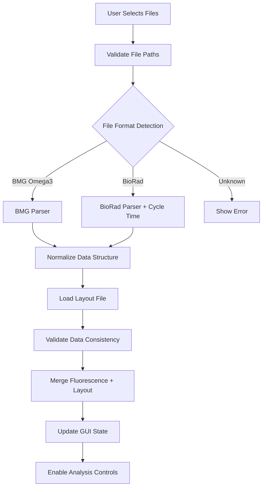
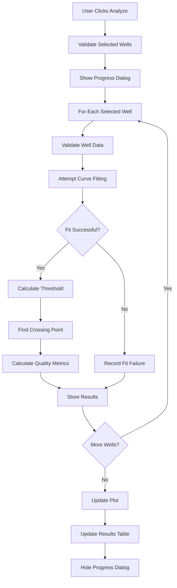
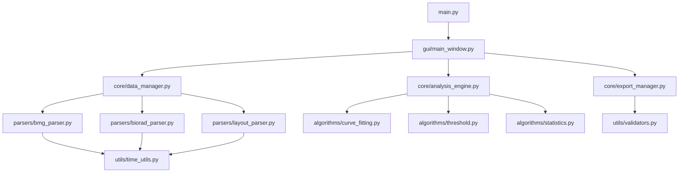

# Simplified Fluorescence Data Analysis Tool - Technical Specifications

## Document Overview

This document provides comprehensive technical specifications for implementing the simplified fluorescence data analysis tool based on the architecture design in [`simplified_fluorescence_tool_architecture.md`](simplified_fluorescence_tool_architecture.md). These specifications are implementation-ready and include detailed module definitions, API contracts, algorithms, and testing requirements.

## Table of Contents

1. [Module Structure and API Specifications](#1-module-structure-and-api-specifications)
2. [File Format Parsing Specifications](#2-file-format-parsing-specifications)
3. [Algorithm Implementation Specifications](#3-algorithm-implementation-specifications)
4. [GUI Component Specifications](#4-gui-component-specifications)
5. [Data Flow and State Management](#5-data-flow-and-state-management)
6. [Output Format Specifications](#6-output-format-specifications)
7. [Testing Requirements](#7-testing-requirements)
8. [Error Handling and Validation](#8-error-handling-and-validation)
9. [Deployment and Environment Setup](#9-deployment-and-environment-setup)
10. [Integration Points and Dependencies](#10-integration-points-and-dependencies)

---

## 1. Module Structure and API Specifications

### 1.1 Project Structure
```
fluorescence_tool/
├── main.py                 # Application entry point
├── environment.yml         # Conda environment specification
├── gui/
│   ├── __init__.py
│   ├── main_window.py     # Main application window
│   ├── file_loader.py     # File loading interface
│   ├── plate_view.py      # Interactive plate visualization
│   ├── plot_panel.py      # Plot display and controls
│   └── dialogs.py         # Export and settings dialogs
├── core/
│   ├── __init__.py
│   ├── data_manager.py    # Central data management
│   ├── analysis_engine.py # Curve fitting and analysis
│   └── export_manager.py  # File export functionality
├── parsers/
│   ├── __init__.py
│   ├── base_parser.py     # Abstract base parser
│   ├── bmg_parser.py      # BMG Omega3 format parser
│   ├── biorad_parser.py   # BioRad format parser
│   └── layout_parser.py   # Layout file parser
├── algorithms/
│   ├── __init__.py
│   ├── curve_fitting.py   # Sigmoid curve fitting
│   ├── threshold.py       # Threshold detection
│   └── statistics.py      # Statistical calculations
└── utils/
    ├── __init__.py
    ├── validators.py      # Data validation utilities
    ├── time_utils.py      # Time conversion utilities
    └── constants.py       # Application constants
```

### 1.2 Core Data Structures

Based on analysis of the existing codebase, these data structures can be adapted from the current implementation:

```python
from dataclasses import dataclass
from typing import List, Dict, Any, Optional
import numpy as np
from enum import Enum

class FileFormat(Enum):
    """Supported file formats for fluorescence data."""
    BMG_OMEGA3 = "bmg_omega3"
    BIORAD = "biorad"
    UNKNOWN = "unknown"

@dataclass
class FluorescenceData:
    """Normalized fluorescence data structure for both file formats."""
    time_points: List[float]        # Time values in hours
    wells: List[str]                # Well identifiers (A1, A2, etc.)
    measurements: np.ndarray        # Raw fluorescence values [wells x timepoints]
    metadata: Dict[str, Any]        # File format, instrument info, etc.
    format_type: FileFormat         # Source file format
    
    def __post_init__(self):
        """Validate data consistency after initialization."""
        if len(self.wells) != self.measurements.shape[0]:
            raise ValueError("Number of wells must match measurement rows")
        if len(self.time_points) != self.measurements.shape[1]:
            raise ValueError("Number of time points must match measurement columns")

@dataclass
class WellInfo:
    """Well layout information from layout file."""
    well_id: str                    # A1, B2, etc.
    plate_id: str                   # From layout file
    sample: str                     # Sample identifier
    well_type: str                  # sample, neg_cntrl, unused, etc.
    cell_count: Optional[int]       # Number of cells/capsules
    group_1: Optional[str]          # Primary grouping
    group_2: Optional[str]          # Secondary grouping  
    group_3: Optional[str]          # Tertiary grouping

@dataclass
class CurveFitResult:
    """Curve fitting analysis results."""
    well_id: str
    fitted_params: np.ndarray       # Sigmoid parameters [a, b, c, d, g]
    fitted_curve: np.ndarray        # Fitted y-values
    r_squared: float                # Goodness of fit
    crossing_point: float           # Time at threshold crossing
    threshold_value: float          # Fluorescence threshold
    delta_fluorescence: float       # End - Start fluorescence
    fit_quality: str               # "excellent", "good", "poor"
    convergence_info: Dict[str, Any] # Optimization details
```

### 1.3 Module API Specifications

#### 1.3.1 Data Manager API
```python
class DataManager:
    """Central data management for fluorescence analysis."""
    
    def __init__(self):
        self.fluorescence_data: Optional[FluorescenceData] = None
        self.layout_data: Dict[str, WellInfo] = {}
        self.analysis_results: Dict[str, CurveFitResult] = {}
        self.selected_wells: List[str] = []
    
    def load_fluorescence_file(self, file_path: str, cycle_time_minutes: Optional[float] = None) -> bool:
        """Load and parse fluorescence data file."""
        pass
    
    def load_layout_file(self, file_path: str) -> bool:
        """Load and parse layout file."""
        pass
    
    def get_merged_data(self) -> Dict[str, Any]:
        """Get fluorescence data merged with layout information."""
        pass
    
    def validate_data_consistency(self) -> List[str]:
        """Validate consistency between fluorescence and layout data."""
        pass
    
    def get_well_groups(self) -> Dict[str, List[str]]:
        """Get wells organized by grouping criteria."""
        pass
```

#### 1.3.2 Analysis Engine API
```python
class AnalysisEngine:
    """Curve fitting and threshold analysis engine."""
    
    def __init__(self, data_manager: DataManager):
        self.data_manager = data_manager
        self.fit_parameters = self._get_default_fit_parameters()
    
    def fit_curves(self, wells: List[str], method: str = "5param_sigmoid") -> Dict[str, CurveFitResult]:
        """Fit curves to specified wells."""
        pass
    
    def calculate_thresholds(self, wells: List[str], method: str = "derivative") -> Dict[str, float]:
        """Calculate threshold values for specified wells."""
        pass
    
    def calculate_statistics(self, wells: List[str]) -> Dict[str, Any]:
        """Calculate statistical summaries for well groups."""
        pass
    
    def update_fit_parameters(self, parameters: Dict[str, Any]) -> None:
        """Update curve fitting parameters."""
        pass
```

---

## 2. File Format Parsing Specifications

### 2.1 BMG Omega3 Format Parser

Based on analysis of [`example_input_files/RM5097.96HL.BNCT.1.CSV`](../example_input_files/RM5097.96HL.BNCT.1.CSV), the BMG Omega3 format has the following structure:

#### 2.1.1 File Structure
```
Row 1: User info and metadata
Row 2: Test name, date, time
Row 3: Kinetic range information
Row 4: ID1 (plate identifier), ID2
Row 5: Measurement type (e.g., "Fluorescence (FI)")
Row 6: Empty row
Row 7: Column headers (Well Row, Well Col, Content, Raw Data...)
Row 8: Time point headers (Time, 0 h, 0 h 15 min, 0 h 30 min, ...)
Row 9+: Well data (A, 1, A1, measurement1, measurement2, ...)
```

#### 2.1.2 Implementation Specification
```python
class BMGOmega3Parser:
    """Parser for BMG Omega3 CSV format files."""
    
    def __init__(self):
        self.time_pattern = re.compile(r'^(\d+)\s*h(?:\s*(\d+)\s*min)?$')
        self.min_pattern = re.compile(r'^(\d+)\s*min$')
    
    def parse_file(self, file_path: str) -> FluorescenceData:
        """
        Parse BMG Omega3 CSV file.
        
        Args:
            file_path: Path to BMG CSV file
            
        Returns:
            FluorescenceData object with parsed data
            
        Raises:
            FileFormatError: If file format is invalid
            DataValidationError: If data validation fails
        """
        try:
            with open(file_path, 'r', encoding='utf-8') as f:
                lines = f.readlines()
            
            # Validate minimum file length
            if len(lines) < 9:
                raise FileFormatError("BMG file too short, minimum 9 lines required")
            
            # Extract metadata
            metadata = self._extract_metadata(lines[:6])
            
            # Parse time headers (row 8, columns 4+)
            time_points = self._parse_time_headers(lines[7])
            
            # Parse well data (rows 9+)
            wells, measurements = self._parse_well_data(lines[8:], len(time_points))
            
            return FluorescenceData(
                time_points=time_points,
                wells=wells,
                measurements=measurements,
                metadata=metadata,
                format_type=FileFormat.BMG_OMEGA3
            )
            
        except Exception as e:
            raise FileFormatError(f"Failed to parse BMG file: {str(e)}")
    
    def _extract_metadata(self, header_lines: List[str]) -> Dict[str, Any]:
        """Extract metadata from header lines."""
        metadata = {}
        
        # Row 1: User info
        if len(header_lines) > 0:
            user_line = header_lines[0].strip()
            user_match = re.search(r'User:\s*([^,]+)', user_line)
            if user_match:
                metadata['user'] = user_match.group(1).strip()
        
        # Row 2: Test info
        if len(header_lines) > 1:
            test_line = header_lines[1].strip()
            test_match = re.search(r'Test name:\s*([^,]+)', test_line)
            date_match = re.search(r'Date:\s*([^,]+)', test_line)
            time_match = re.search(r'Time:\s*([^,]+)', test_line)
            
            if test_match:
                metadata['test_name'] = test_match.group(1).strip()
            if date_match:
                metadata['date'] = date_match.group(1).strip()
            if time_match:
                metadata['time'] = time_match.group(1).strip()
        
        # Row 4: Plate ID
        if len(header_lines) > 3:
            id_line = header_lines[3].strip()
            id_match = re.search(r'ID1:\s*([^,]+)', id_line)
            if id_match:
                metadata['plate_id'] = id_match.group(1).strip()
        
        return metadata
    
    def _parse_time_headers(self, time_header_line: str) -> List[float]:
        """Parse time point headers into decimal hours."""
        parts = time_header_line.strip().split(',')
        
        # Skip first 3 columns (Well Row, Well Col, Content)
        time_headers = [part.strip() for part in parts[3:] if part.strip()]
        
        time_points = []
        for header in time_headers:
            if header.lower() == 'time':
                continue
            
            try:
                time_hours = self._parse_time_string(header)
                time_points.append(time_hours)
            except ValueError as e:
                raise FileFormatError(f"Invalid time header '{header}': {str(e)}")
        
        return time_points
    
    def _parse_time_string(self, time_str: str) -> float:
        """
        Parse BMG time format strings into decimal hours.
        
        Supports formats:
        - "1 h 30 min" → 1.5 hours
        - "2 h" → 2.0 hours
        - "45 min" → 0.75 hours
        """
        time_str = time_str.strip()
        
        # Try full pattern (hours with optional minutes)
        match = self.time_pattern.match(time_str)
        if match:
            hours = int(match.group(1))
            minutes = int(match.group(2)) if match.group(2) else 0
            
            if minutes >= 60:
                raise ValueError(f"Invalid minutes value: {minutes}")
            
            return hours + (minutes / 60.0)
        
        # Try minutes-only pattern
        match = self.min_pattern.match(time_str)
        if match:
            minutes = int(match.group(1))
            return minutes / 60.0
        
        raise ValueError(f"Invalid time format: '{time_str}'")
    
    def _parse_well_data(self, data_lines: List[str], num_timepoints: int) -> Tuple[List[str], np.ndarray]:
        """Parse well data from data lines."""
        wells = []
        measurements_list = []
        
        for line in data_lines:
            parts = line.strip().split(',')
            if len(parts) < 4:  # Skip incomplete lines
                continue
            
            # Extract well information
            well_row = parts[0].strip()
            well_col = parts[1].strip()
            well_id = parts[2].strip()
            
            if not well_row or not well_col or not well_id:
                continue
            
            # Extract measurements (skip first 3 columns)
            measurement_strs = parts[3:3+num_timepoints]
            
            try:
                measurements = [float(m.strip()) for m in measurement_strs if m.strip()]
                
                if len(measurements) == num_timepoints:
                    wells.append(well_id)
                    measurements_list.append(measurements)
                    
            except ValueError:
                # Skip wells with invalid measurement data
                continue
        
        if not wells:
            raise DataValidationError("No valid well data found")
        
        measurements_array = np.array(measurements_list)
        return wells, measurements_array
```

### 2.2 BioRad Format Parser

Based on analysis of [`example_input_files/TEST01.BIORAD.FORMAT.1.txt`](../example_input_files/TEST01.BIORAD.FORMAT.1.txt), the BioRad format has the following structure:

#### 2.2.1 File Structure
```
Row 1: Headers (Cycle, A1, A2, A3, ..., P24)
Row 2+: Data (1, measurement_A1, measurement_A2, ...)
```

#### 2.2.2 Implementation Specification
```python
class BioRadParser:
    """Parser for BioRad text format files."""
    
    def parse_file(self, file_path: str, cycle_time_minutes: float) -> FluorescenceData:
        """
        Parse BioRad text file.
        
        Args:
            file_path: Path to BioRad text file
            cycle_time_minutes: Time between cycles in minutes
            
        Returns:
            FluorescenceData object with parsed data
            
        Raises:
            FileFormatError: If file format is invalid
            DataValidationError: If data validation fails
        """
        if cycle_time_minutes <= 0:
            raise ValueError("Cycle time must be positive")
        
        try:
            # Read file with tab separation
            df = pd.read_csv(file_path, sep='\t')
            
            # Validate structure
            if 'Cycle' not in df.columns:
                raise FileFormatError("BioRad file missing 'Cycle' column")
            
            # Extract well columns (all except 'Cycle')
            well_columns = [col for col in df.columns if col != 'Cycle']
            
            if not well_columns:
                raise FileFormatError("No well data columns found")
            
            # Generate time points from cycle numbers
            cycles = df['Cycle'].values
            time_points = [(cycle - 1) * (cycle_time_minutes / 60.0) for cycle in cycles]
            
            # Extract measurements (transpose to get wells x timepoints)
            measurements = df[well_columns].values.T
            
            # Create metadata
            metadata = {
                'cycle_time_minutes': cycle_time_minutes,
                'num_cycles': len(cycles),
                'plate_format': self._detect_plate_format(well_columns)
            }
            
            return FluorescenceData(
                time_points=time_points,
                wells=well_columns,
                measurements=measurements,
                metadata=metadata,
                format_type=FileFormat.BIORAD
            )
            
        except Exception as e:
            raise FileFormatError(f"Failed to parse BioRad file: {str(e)}")
    
    def _detect_plate_format(self, well_columns: List[str]) -> str:
        """Detect plate format (96-well, 384-well) from well names."""
        max_row = 'A'
        max_col = 1
        
        for well in well_columns:
            if len(well) >= 2:
                row = well[0]
                try:
                    col = int(well[1:])
                    if row > max_row:
                        max_row = row
                    if col > max_col:
                        max_col = col
                except ValueError:
                    continue
        
        if max_row <= 'H' and max_col <= 12:
            return "96-well"
        elif max_row <= 'P' and max_col <= 24:
            return "384-well"
        else:
            return "unknown"
```

### 2.3 Layout File Parser

Based on analysis of [`example_input_files/RM5097_layout.csv`](../example_input_files/RM5097_layout.csv):

#### 2.3.1 Expected Format
```csv
Plate_ID,Well_Row,Well_Col,Well,Type,number_of_cells/capsules,Group_1,Group_2,Group_3
RM5097.96HL.BNCT.1,A,1,A1,unused,,,,
RM5097.96HL.BNCT.1,B,1,B1,sample,100,Rep1,BONCAT,
```

#### 2.3.2 Implementation Specification
```python
class LayoutParser:
    """Parser for layout CSV files."""
    
    REQUIRED_COLUMNS = ['Plate_ID', 'Well_Row', 'Well_Col', 'Well', 'Type']
    OPTIONAL_COLUMNS = ['number_of_cells/capsules', 'Group_1', 'Group_2', 'Group_3']
    
    def parse_file(self, file_path: str) -> Dict[str, WellInfo]:
        """
        Parse layout CSV file.
        
        Args:
            file_path: Path to layout CSV file
            
        Returns:
            Dictionary mapping well IDs to WellInfo objects
            
        Raises:
            FileFormatError: If file format is invalid
            DataValidationError: If data validation fails
        """
        try:
            # Read CSV with flexible encoding detection
            df = pd.read_csv(file_path, encoding='utf-8-sig')  # Handle BOM
            
            # Validate required columns
            missing_cols = [col for col in self.REQUIRED_COLUMNS if col not in df.columns]
            if missing_cols:
                raise FileFormatError(f"Missing required columns: {missing_cols}")
            
            # Parse well information
            well_info_dict = {}
            
            for _, row in df.iterrows():
                well_id = str(row['Well']).strip()
                
                if not well_id or well_id.lower() == 'nan':
                    continue
                
                # Extract optional fields with safe defaults
                cell_count = self._safe_int(row.get('number_of_cells/capsules'))
                group_1 = self._safe_str(row.get('Group_1'))
                group_2 = self._safe_str(row.get('Group_2'))
                group_3 = self._safe_str(row.get('Group_3'))
                
                well_info = WellInfo(
                    well_id=well_id,
                    plate_id=str(row['Plate_ID']).strip(),
                    sample=self._safe_str(row.get('Sample', '')),
                    well_type=str(row['Type']).strip().lower(),
                    cell_count=cell_count,
                    group_1=group_1,
                    group_2=group_2,
                    group_3=group_3
                )
                
                well_info_dict[well_id] = well_info
            
            if not well_info_dict:
                raise DataValidationError("No valid well information found")
            
            return well_info_dict
            
        except Exception as e:
            raise FileFormatError(f"Failed to parse layout file: {str(e)}")
    
    def _safe_str(self, value) -> Optional[str]:
        """Safely convert value to string, handling NaN and empty values."""
        if pd.isna(value) or str(value).strip() == '':
            return None
        return str(value).strip()
    
    def _safe_int(self, value) -> Optional[int]:
        """Safely convert value to integer, handling NaN and invalid values."""
        if pd.isna(value):
            return None
        try:
            return int(float(value))
        except (ValueError, TypeError):
            return None
```

## 3. Algorithm Implementation Specifications

### 3.1 5-Parameter Sigmoid Curve Fitting

Based on analysis of [`analyze_fluorescence_data.py`](../analyze_fluorescence_data.py), the curve fitting implementation uses a proven adaptive approach with multiple fitting strategies.

#### 3.1.1 Mathematical Model
```python
def sigmoid_5param(x, a, b, c, d, e):
    """
    5-parameter sigmoid function for fluorescence curve fitting.
    
    Mathematical form: y = a / (1 + exp(-b * (x - c))) + d + e * x
    
    Args:
        x: Time points (hours)
        a: Amplitude (difference between upper and lower asymptotes)
        b: Slope factor (steepness of the curve, can be negative)
        c: Inflection point (time at maximum slope)
        d: Baseline (minimum fluorescence)
        e: Linear component (accounts for linear drift)
    
    Returns:
        Fitted fluorescence values
    """
    try:
        # Limit b to prevent overflow in exp (proven strategy from existing code)
        b = max(min(b, 10), -10)
        
        # Calculate exponent with overflow protection
        exp_val = np.exp(-b * (x - c))
        
        # Handle division by zero or very small numbers
        denom = 1 + exp_val
        result = a / denom + d + e * x
        
        # Check for NaN or inf values
        if not np.all(np.isfinite(result)):
            raise ValueError("Overflow detected in sigmoid calculation")
        
        return result
        
    except Exception as e:
        print(f"Error in sigmoid calculation: {e}")
        return np.full_like(x, np.nan)
```

#### 3.1.2 Adaptive Fitting Strategy
Based on the proven approach in the existing code, implement multiple fitting attempts:

```python
class CurveFitter:
    """5-parameter sigmoid curve fitting with adaptive strategy."""
    
    def __init__(self):
        self.fit_attempts = [
            {
                "name": "Standard fit",
                "initial_guess_strategy": self._standard_initial_guess,
                "bounds_strategy": self._standard_bounds
            },
            {
                "name": "Steep curve fit",
                "initial_guess_strategy": self._steep_initial_guess,
                "bounds_strategy": self._steep_bounds
            },
            {
                "name": "Wide range fit",
                "initial_guess_strategy": self._wide_initial_guess,
                "bounds_strategy": self._wide_bounds
            }
        ]
        self.timeout_seconds = 2  # Per fit attempt
        self.max_iterations = 5000
    
    def fit_curve(self, time_points: np.ndarray, measurements: np.ndarray,
                  well_id: str) -> CurveFitResult:
        """
        Fit 5-parameter sigmoid curve using adaptive strategy.
        
        Args:
            time_points: Time values in hours
            measurements: Fluorescence measurements
            well_id: Well identifier for result tracking
            
        Returns:
            CurveFitResult with fitted parameters and quality metrics
        """
        # Validate input data
        self._validate_input_data(time_points, measurements)
        
        # Check if there's enough variation to fit a curve
        if np.max(measurements) - np.min(measurements) < 0.1:
            raise CurveFittingError(f"Insufficient variation in data for well {well_id}")
        
        best_fit = None
        best_error = float('inf')
        
        # Try each fitting strategy
        for attempt in self.fit_attempts:
            try:
                result = self._attempt_fit(time_points, measurements, attempt)
                if result and result['error'] < best_error:
                    best_error = result['error']
                    best_fit = result
                    
            except Exception as e:
                print(f"Warning: {attempt['name']} failed for well {well_id}: {e}")
                continue
        
        if best_fit is None:
            raise CurveFittingError(f"All fitting attempts failed for well {well_id}")
        
        # Generate final result
        return self._create_curve_fit_result(
            well_id, time_points, measurements, best_fit
        )
    
    def _attempt_fit(self, time_points: np.ndarray, measurements: np.ndarray,
                    attempt: Dict[str, Any]) -> Optional[Dict[str, Any]]:
        """Attempt a single curve fit with timeout protection."""
        import signal
        
        class TimeoutException(Exception):
            pass
        
        def timeout_handler(signum, frame):
            raise TimeoutException("Curve fitting timed out")
        
        # Set timeout
        signal.signal(signal.SIGALRM, timeout_handler)
        signal.alarm(self.timeout_seconds)
        
        try:
            # Generate initial guess and bounds
            initial_guess = attempt['initial_guess_strategy'](time_points, measurements)
            bounds = attempt['bounds_strategy'](time_points, measurements)
            
            # Perform curve fitting
            popt, pcov = curve_fit(
                sigmoid_5param, time_points, measurements,
                p0=initial_guess,
                bounds=bounds,
                maxfev=self.max_iterations
            )
            
            # Validate results
            if pcov is None or not np.all(np.isfinite(pcov)):
                return None
            
            if not np.all(np.isfinite(popt)) or any(p == 0 for p in popt[:4]):
                return None
            
            # Calculate fit error
            fitted_values = sigmoid_5param(time_points, *popt)
            error = np.sum((measurements - fitted_values) ** 2)
            
            return {
                'parameters': popt,
                'covariance': pcov,
                'fitted_values': fitted_values,
                'error': error,
                'method': attempt['name']
            }
            
        except TimeoutException:
            return None
        finally:
            signal.alarm(0)  # Cancel timeout
    
    def _standard_initial_guess(self, time_points: np.ndarray,
                               measurements: np.ndarray) -> List[float]:
        """Standard initial parameter estimation."""
        return [
            np.max(measurements) - np.min(measurements),  # a: amplitude
            1.0,  # b: slope factor
            time_points[np.argmax(measurements)],  # c: inflection point
            np.min(measurements),  # d: baseline
            0.0  # e: linear component
        ]
    
    def _steep_initial_guess(self, time_points: np.ndarray,
                            measurements: np.ndarray) -> List[float]:
        """Initial guess for steep curves."""
        return [
            np.max(measurements) - np.min(measurements),  # a: amplitude
            -1.0,  # b: negative slope for steep curves
            time_points[np.argmax(measurements)],  # c: inflection point
            np.min(measurements),  # d: baseline
            0.0  # e: linear component
        ]
    
    def _wide_initial_guess(self, time_points: np.ndarray,
                           measurements: np.ndarray) -> List[float]:
        """Initial guess for wide range fitting."""
        return [
            np.max(measurements) - np.min(measurements),  # a: amplitude
            0.5,  # b: moderate slope
            time_points[len(time_points)//2],  # c: midpoint estimate
            np.min(measurements),  # d: baseline
            0.0  # e: linear component
        ]
    
    def _standard_bounds(self, time_points: np.ndarray,
                        measurements: np.ndarray) -> Tuple[List[float], List[float]]:
        """Standard parameter bounds."""
        return (
            [0, 0, min(time_points), min(measurements), -np.inf],
            [np.inf, np.inf, max(time_points), max(measurements), np.inf]
        )
    
    def _steep_bounds(self, time_points: np.ndarray,
                     measurements: np.ndarray) -> Tuple[List[float], List[float]]:
        """Bounds for steep curve fitting."""
        return (
            [0, -10, min(time_points), min(measurements), -np.inf],
            [np.inf, 10, max(time_points), max(measurements), np.inf]
        )
    
    def _wide_bounds(self, time_points: np.ndarray,
                    measurements: np.ndarray) -> Tuple[List[float], List[float]]:
        """Bounds for wide range fitting."""
        return (
            [0, -5, min(time_points), min(measurements), -np.inf],
            [np.inf, 5, max(time_points), max(measurements), np.inf]
        )
```

### 3.2 Threshold Detection Algorithm

Based on analysis of [`analyze_fluorescence_data.py`](../analyze_fluorescence_data.py), implement the proven baseline percentage method:

#### 3.2.1 Baseline Percentage Method
```python
class ThresholdDetector:
    """Threshold detection using baseline percentage method."""
    
    def __init__(self):
        self.default_baseline_points = 3  # Use first 3 time points
        self.default_percentage = 10.0    # 10% above baseline
    
    def calculate_threshold(self, measurements: np.ndarray,
                          baseline_points: int = None,
                          percentage: float = None) -> float:
        """
        Calculate threshold as percentage above baseline.
        
        Based on proven method: threshold = mean(early_points) * (1 + percentage/100)
        
        Args:
            measurements: Fluorescence measurements
            baseline_points: Number of early points for baseline (default: 3)
            percentage: Percentage above baseline (default: 10%)
            
        Returns:
            Threshold value
        """
        baseline_points = baseline_points or self.default_baseline_points
        percentage = percentage or self.default_percentage
        
        # Calculate baseline from early time points (indices 1-3, skipping index 0)
        baseline_values = measurements[1:baseline_points+1]
        baseline = np.mean(baseline_values)
        
        # Calculate threshold as percentage above baseline
        threshold = baseline * (1 + percentage / 100.0)
        
        return threshold
    
    def find_crossing_point(self, time_points: np.ndarray,
                           fitted_curve: np.ndarray,
                           threshold: float) -> Optional[float]:
        """
        Find threshold crossing point using linear interpolation.
        
        Args:
            time_points: Time values in hours
            fitted_curve: Fitted fluorescence values (not raw data)
            threshold: Threshold value to cross
            
        Returns:
            Crossing time in hours, or None if no crossing found
        """
        # Find where fitted curve crosses threshold
        for i in range(1, len(fitted_curve)):
            if fitted_curve[i] > threshold and fitted_curve[i-1] <= threshold:
                # Linear interpolation between crossing points
                t1, y1 = time_points[i-1], fitted_curve[i-1]
                t2, y2 = time_points[i], fitted_curve[i]
                
                # Calculate exact crossing time
                crossing_time = t1 + (threshold - y1) * (t2 - t1) / (y2 - y1)
                return crossing_time
        
        return None  # No crossing found
```

### 3.3 Data Validation and Quality Control

Based on the robust validation in the existing code:

#### 3.3.1 Input Data Validation
```python
class DataValidator:
    """Data validation for fluorescence analysis."""
    
    def validate_fluorescence_data(self, time_points: np.ndarray,
                                 measurements: np.ndarray) -> List[str]:
        """
        Comprehensive validation of fluorescence data.
        
        Returns:
            List of validation warnings/errors
        """
        issues = []
        
        # Basic structure validation
        if len(time_points) != len(measurements):
            issues.append("Time points and measurements must have same length")
        
        if len(time_points) < 5:
            issues.append("Minimum 5 data points required for curve fitting")
        
        # Data quality validation
        if np.any(np.isnan(time_points)) or np.any(np.isnan(measurements)):
            issues.append("NaN values detected in data")
        
        if np.any(measurements < 0):
            issues.append("Negative fluorescence values detected")
        
        # Variation check (from existing code)
        variation = np.max(measurements) - np.min(measurements)
        if variation < 0.1:
            issues.append(f"Insufficient data variation ({variation:.3f}) for curve fitting")
        
        # Time progression check
        if not np.all(np.diff(time_points) > 0):
            issues.append("Time points must be in ascending order")
        
        return issues
    
    def clean_fluorescence_data(self, measurements: np.ndarray) -> np.ndarray:
        """
        Clean fluorescence data using interpolation strategy from existing code.
        
        Args:
            measurements: Raw fluorescence measurements
            
        Returns:
            Cleaned measurements with NaN/inf values handled
        """
        # Convert to pandas Series for interpolation
        series = pd.Series(measurements)
        
        # Replace NaN or inf values with interpolation
        cleaned = series.interpolate().ffill().bfill().values
        
        return cleaned
```

### 3.4 Statistical Analysis

#### 3.4.1 Fit Quality Assessment
```python
class FitQualityAssessor:
    """Assess curve fitting quality using multiple metrics."""
    
    def assess_fit_quality(self, measurements: np.ndarray,
                          fitted_curve: np.ndarray,
                          parameters: np.ndarray,
                          covariance: Optional[np.ndarray]) -> str:
        """
        Assess overall fit quality based on multiple criteria.
        
        Returns:
            Quality rating: "excellent", "good", "fair", or "poor"
        """
        # Calculate R-squared
        r_squared = self._calculate_r_squared(measurements, fitted_curve)
        
        # Base quality on R-squared
        if r_squared >= 0.95:
            quality = "excellent"
        elif r_squared >= 0.85:
            quality = "good"
        elif r_squared >= 0.70:
            quality = "fair"
        else:
            quality = "poor"
        
        # Additional quality checks
        if covariance is None:
            quality = "poor"  # No covariance indicates poor convergence
        
        # Check for reasonable parameter values
        a, b, c, d, e = parameters
        if a <= 0 or d < 0:
            quality = "poor"
        
        return quality
    
    def _calculate_r_squared(self, observed: np.ndarray,
                           predicted: np.ndarray) -> float:
        """Calculate R-squared goodness of fit."""
        ss_res = np.sum((observed - predicted) ** 2)
        ss_tot = np.sum((observed - np.mean(observed)) ** 2)
        
        if ss_tot == 0:
            return 1.0 if ss_res == 0 else 0.0
        
        return 1 - (ss_res / ss_tot)
```

## 4. GUI Component Specifications

### 4.1 Main Window Architecture

Based on the architecture design, implement a tkinter-based desktop application with the following layout:

#### 4.1.1 Main Window Class
```python
import tkinter as tk
from tkinter import ttk, filedialog, messagebox
import matplotlib.pyplot as plt
from matplotlib.backends.backend_tkagg import FigureCanvasTkAgg
from matplotlib.figure import Figure

class MainWindow:
    """Main application window for fluorescence analysis tool."""
    
    def __init__(self):
        self.root = tk.Tk()
        self.root.title("Fluorescence Data Analysis Tool")
        self.root.geometry("1200x800")
        self.root.minsize(800, 600)
        
        # Initialize data managers
        self.data_manager = DataManager()
        self.analysis_engine = AnalysisEngine(self.data_manager)
        self.export_manager = ExportManager()
        
        # GUI state variables
        self.selected_wells = set()
        self.grouping_vars = {}
        
        # Create GUI components
        self._create_menu_bar()
        self._create_main_layout()
        self._create_status_bar()
        
        # Bind events
        self._bind_events()
    
    def _create_main_layout(self):
        """Create the main two-panel layout."""
        # Create main paned window
        main_paned = ttk.PanedWindow(self.root, orient=tk.HORIZONTAL)
        main_paned.pack(fill=tk.BOTH, expand=True, padx=5, pady=5)
        
        # Left panel - File loading and plate view
        left_frame = ttk.Frame(main_paned, width=350)
        self._create_left_panel(left_frame)
        main_paned.add(left_frame, weight=1)
        
        # Right panel - Plot and controls
        right_frame = ttk.Frame(main_paned)
        self._create_right_panel(right_frame)
        main_paned.add(right_frame, weight=2)
    
    def _create_left_panel(self, parent):
        """Create left panel with file loading and plate view."""
        # File loading section
        self._create_file_loading_panel(parent)
        
        # Plate view section
        self.plate_view = PlateView(parent, self.data_manager)
        self.plate_view.set_selection_callback(self._on_well_selection_changed)
    
    def _create_right_panel(self, parent):
        """Create right panel with plot and controls."""
        # Plot panel
        self.plot_panel = PlotPanel(parent, self.data_manager)
        
        # Analysis controls
        self._create_analysis_controls(parent)
```

#### 4.1.2 File Loading Panel
```python
def _create_file_loading_panel(self, parent):
    """Create file loading interface."""
    file_frame = ttk.LabelFrame(parent, text="File Loading", padding=10)
    file_frame.pack(fill=tk.X, padx=5, pady=5)
    
    # Fluorescence file selection
    ttk.Label(file_frame, text="Fluorescence Data:").grid(row=0, column=0, sticky=tk.W, pady=2)
    self.fluor_file_var = tk.StringVar()
    fluor_entry = ttk.Entry(file_frame, textvariable=self.fluor_file_var, width=25)
    fluor_entry.grid(row=0, column=1, padx=5, pady=2, sticky=tk.EW)
    ttk.Button(file_frame, text="Browse",
              command=self._browse_fluorescence_file).grid(row=0, column=2, padx=5, pady=2)
    
    # Layout file selection
    ttk.Label(file_frame, text="Layout File:").grid(row=1, column=0, sticky=tk.W, pady=2)
    self.layout_file_var = tk.StringVar()
    layout_entry = ttk.Entry(file_frame, textvariable=self.layout_file_var, width=25)
    layout_entry.grid(row=1, column=1, padx=5, pady=2, sticky=tk.EW)
    ttk.Button(file_frame, text="Browse",
              command=self._browse_layout_file).grid(row=1, column=2, padx=5, pady=2)
    
    # BioRad cycle time input (conditional)
    ttk.Label(file_frame, text="Cycle Time (min):").grid(row=2, column=0, sticky=tk.W, pady=2)
    self.cycle_time_var = tk.StringVar(value="15")
    cycle_entry = ttk.Entry(file_frame, textvariable=self.cycle_time_var, width=10)
    cycle_entry.grid(row=2, column=1, sticky=tk.W, padx=5, pady=2)
    
    # Configure column weights
    file_frame.columnconfigure(1, weight=1)
    
    # Process button
    self.process_btn = ttk.Button(file_frame, text="Process Files",
                                 command=self._process_files, state=tk.DISABLED)
    self.process_btn.grid(row=3, column=1, pady=10)
    
    # Status indicator
    self.file_status_var = tk.StringVar(value="No files loaded")
    status_label = ttk.Label(file_frame, textvariable=self.file_status_var,
                            foreground="blue")
    status_label.grid(row=4, column=0, columnspan=3, pady=5)

def _browse_fluorescence_file(self):
    """Open file dialog for fluorescence data."""
    filetypes = [
        ("CSV files", "*.csv"),
        ("Text files", "*.txt"),
        ("All files", "*.*")
    ]
    filename = filedialog.askopenfilename(
        title="Select Fluorescence Data File",
        filetypes=filetypes
    )
    if filename:
        self.fluor_file_var.set(filename)
        self._check_files_ready()

def _process_files(self):
    """Process selected files."""
    try:
        # Show processing status
        self.file_status_var.set("Processing files...")
        self.root.update()
        
        # Load fluorescence file
        fluor_path = self.fluor_file_var.get()
        cycle_time = None
        if self.cycle_time_var.get():
            try:
                cycle_time = float(self.cycle_time_var.get())
            except ValueError:
                messagebox.showerror("Error", "Invalid cycle time value")
                return
        
        success = self.data_manager.load_fluorescence_file(fluor_path, cycle_time)
        if not success:
            self.file_status_var.set("Error loading fluorescence file")
            return
        
        # Load layout file
        layout_path = self.layout_file_var.get()
        success = self.data_manager.load_layout_file(layout_path)
        if not success:
            self.file_status_var.set("Error loading layout file")
            return
        
        # Validate data consistency
        issues = self.data_manager.validate_data_consistency()
        if issues:
            warning_msg = "Data validation warnings:\n" + "\n".join(issues)
            messagebox.showwarning("Data Validation", warning_msg)
        
        # Update GUI components
        self.plate_view.update_plate_layout(self.data_manager.layout_data)
        self.file_status_var.set("Files loaded successfully")
        
        # Enable analysis
        self._enable_analysis_controls()
        
    except Exception as e:
        messagebox.showerror("Error", f"Failed to process files: {str(e)}")
        self.file_status_var.set("Error processing files")
```

### 4.2 Interactive Plate View Component

#### 4.2.1 Plate Visualization
```python
class PlateView:
    """Interactive plate visualization component."""
    
    def __init__(self, parent, data_manager):
        self.parent = parent
        self.data_manager = data_manager
        self.selected_wells = set()
        self.well_buttons = {}
        self.selection_callback = None
        
        # Create plate view frame
        self.frame = ttk.LabelFrame(parent, text="Plate Layout", padding=10)
        self.frame.pack(fill=tk.BOTH, expand=True, padx=5, pady=5)
        
        # Create scrollable canvas for plate
        self._create_scrollable_plate()
        
        # Create grouping controls
        self._create_grouping_controls()
        
        # Create selection info
        self._create_selection_info()
    
    def _create_scrollable_plate(self):
        """Create scrollable canvas for plate layout."""
        canvas_frame = ttk.Frame(self.frame)
        canvas_frame.pack(fill=tk.BOTH, expand=True)
        
        self.canvas = tk.Canvas(canvas_frame, bg='white', height=300)
        v_scrollbar = ttk.Scrollbar(canvas_frame, orient=tk.VERTICAL, command=self.canvas.yview)
        h_scrollbar = ttk.Scrollbar(canvas_frame, orient=tk.HORIZONTAL, command=self.canvas.xview)
        
        self.canvas.configure(yscrollcommand=v_scrollbar.set, xscrollcommand=h_scrollbar.set)
        
        # Pack scrollbars and canvas
        v_scrollbar.pack(side=tk.RIGHT, fill=tk.Y)
        h_scrollbar.pack(side=tk.BOTTOM, fill=tk.X)
        self.canvas.pack(side=tk.LEFT, fill=tk.BOTH, expand=True)
        
        # Create frame inside canvas for well buttons
        self.plate_frame = ttk.Frame(self.canvas)
        self.canvas_window = self.canvas.create_window(0, 0, anchor=tk.NW, window=self.plate_frame)
    
    def update_plate_layout(self, wells_data: Dict[str, WellInfo]):
        """Update plate layout with well data."""
        # Clear existing buttons
        for widget in self.plate_frame.winfo_children():
            widget.destroy()
        self.well_buttons.clear()
        self.selected_wells.clear()
        
        if not wells_data:
            return
        
        # Determine plate format
        plate_format = self._detect_plate_format(wells_data.keys())
        rows, cols = self._get_plate_dimensions(plate_format)
        
        # Create well buttons
        for row_idx in range(rows):
            for col_idx in range(cols):
                well_id = f"{chr(ord('A') + row_idx)}{col_idx + 1}"
                
                if well_id in wells_data:
                    well_info = wells_data[well_id]
                    btn = self._create_well_button(well_id, well_info, row_idx, col_idx)
                else:
                    btn = self._create_empty_well_button(well_id, row_idx, col_idx)
                
                self.well_buttons[well_id] = btn
        
        # Update canvas scroll region
        self.plate_frame.update_idletasks()
        self.canvas.configure(scrollregion=self.canvas.bbox("all"))
        
        # Update grouping controls
        self._update_grouping_controls(wells_data)
    
    def _create_well_button(self, well_id: str, well_info: WellInfo,
                           row: int, col: int) -> tk.Button:
        """Create a button for a well with data."""
        color = self._get_well_color(well_info)
        
        btn = tk.Button(
            self.plate_frame,
            text=well_id,
            width=4,
            height=2,
            bg=color,
            relief=tk.RAISED,
            command=lambda: self._toggle_well_selection(well_id)
        )
        btn.grid(row=row, column=col, padx=1, pady=1)
        
        # Add tooltip with well information
        self._create_tooltip(btn, self._format_well_tooltip(well_info))
        
        return btn
    
    def _get_well_color(self, well_info: WellInfo) -> str:
        """Get color for well based on type and groups."""
        color_map = {
            'sample': '#90EE90',      # Light green
            'neg_cntrl': '#FFB6C1',   # Light pink
            'pos_cntrl': '#87CEEB',   # Sky blue
            'unused': '#D3D3D3',      # Light gray
            'blank': '#F0F0F0'        # Very light gray
        }
        return color_map.get(well_info.well_type, '#FFFFFF')
    
    def _toggle_well_selection(self, well_id: str):
        """Toggle well selection state."""
        if well_id in self.selected_wells:
            self.selected_wells.remove(well_id)
            self.well_buttons[well_id].config(relief=tk.RAISED, bd=1)
        else:
            self.selected_wells.add(well_id)
            self.well_buttons[well_id].config(relief=tk.SUNKEN, bd=3)
        
        self._update_selection_info()
        if self.selection_callback:
            self.selection_callback(list(self.selected_wells))
    
    def _create_grouping_controls(self):
        """Create grouping and filtering controls."""
        controls_frame = ttk.LabelFrame(self.frame, text="Grouping & Filters", padding=5)
        controls_frame.pack(fill=tk.X, pady=5)
        
        # Type filter
        type_frame = ttk.Frame(controls_frame)
        type_frame.pack(fill=tk.X, pady=2)
        ttk.Label(type_frame, text="Type:").pack(side=tk.LEFT)
        
        self.type_vars = {}
        # Will be populated when data is loaded
        
        # Group filters
        self.group_frames = {}
        # Will be populated when data is loaded
        
        # Selection buttons
        button_frame = ttk.Frame(controls_frame)
        button_frame.pack(fill=tk.X, pady=5)
        
        ttk.Button(button_frame, text="Select All",
                  command=self._select_all_wells).pack(side=tk.LEFT, padx=2)
        ttk.Button(button_frame, text="Clear Selection",
                  command=self._clear_selection).pack(side=tk.LEFT, padx=2)
        ttk.Button(button_frame, text="Select by Filter",
                  command=self._select_by_filter).pack(side=tk.LEFT, padx=2)
```

### 4.3 Plot Panel Component

#### 4.3.1 Matplotlib Integration
```python
class PlotPanel:
    """Plot panel with matplotlib integration."""
    
    def __init__(self, parent, data_manager):
        self.parent = parent
        self.data_manager = data_manager
        
        # Create plot frame
        self.frame = ttk.LabelFrame(parent, text="Time-Series Plot", padding=10)
        self.frame.pack(fill=tk.BOTH, expand=True, padx=5, pady=5)
        
        # Create matplotlib figure
        self.figure = Figure(figsize=(10, 6), dpi=100)
        self.ax = self.figure.add_subplot(111)
        
        # Create canvas
        self.canvas = FigureCanvasTkAgg(self.figure, self.frame)
        self.canvas.get_tk_widget().pack(fill=tk.BOTH, expand=True)
        
        # Create toolbar
        self._create_plot_toolbar()
        
        # Initialize empty plot
        self._setup_empty_plot()
    
    def _create_plot_toolbar(self):
        """Create plot control toolbar."""
        toolbar_frame = ttk.Frame(self.frame)
        toolbar_frame.pack(fill=tk.X, pady=5)
        
        # Plot type selection
        ttk.Label(toolbar_frame, text="Show:").pack(side=tk.LEFT, padx=5)
        
        self.show_raw_var = tk.BooleanVar(value=True)
        ttk.Checkbutton(toolbar_frame, text="Raw Data",
                       variable=self.show_raw_var,
                       command=self._update_plot).pack(side=tk.LEFT, padx=5)
        
        self.show_fitted_var = tk.BooleanVar(value=True)
        ttk.Checkbutton(toolbar_frame, text="Fitted Curves",
                       variable=self.show_fitted_var,
                       command=self._update_plot).pack(side=tk.LEFT, padx=5)
        
        self.show_threshold_var = tk.BooleanVar(value=True)
        ttk.Checkbutton(toolbar_frame, text="Thresholds",
                       variable=self.show_threshold_var,
                       command=self._update_plot).pack(side=tk.LEFT, padx=5)
        
        self.show_crossing_var = tk.BooleanVar(value=True)
        ttk.Checkbutton(toolbar_frame, text="Crossing Points",
                       variable=self.show_crossing_var,
                       command=self._update_plot).pack(side=tk.LEFT, padx=5)
        
        # Export button
        ttk.Button(toolbar_frame, text="Export Plot",
                  command=self._export_plot).pack(side=tk.RIGHT, padx=5)
        
        # Analyze button
        self.analyze_btn = ttk.Button(toolbar_frame, text="Analyze Selected",
                                     command=self._analyze_selected_wells,
                                     state=tk.DISABLED)
        self.analyze_btn.pack(side=tk.RIGHT, padx=5)
    
    def update_plot(self, selected_wells: List[str]):
        """Update plot with selected wells."""
        self.ax.clear()
        
        if not selected_wells or not self.data_manager.fluorescence_data:
            self._setup_empty_plot()
            self.canvas.draw()
            return
        
        # Plot each selected well
        fluorescence_data = self.data_manager.fluorescence_data
        analysis_results = self.data_manager.analysis_results
        
        colors = plt.cm.tab10(np.linspace(0, 1, len(selected_wells)))
        
        for i, well_id in enumerate(selected_wells):
            if well_id in fluorescence_data.wells:
                color = colors[i]
                self._plot_well_data(well_id, fluorescence_data, analysis_results, color)
        
        # Configure plot appearance
        self._configure_plot_appearance()
        self.canvas.draw()
        
        # Enable analyze button if wells are selected
        self.analyze_btn.config(state=tk.NORMAL if selected_wells else tk.DISABLED)
    
    def _plot_well_data(self, well_id: str, fluorescence_data: FluorescenceData,
                       analysis_results: Dict[str, CurveFitResult], color):
        """Plot data for a single well."""
        well_idx = fluorescence_data.wells.index(well_id)
        time_points = np.array(fluorescence_data.time_points)
        measurements = fluorescence_data.measurements[well_idx]
        
        # Plot raw data if requested
        if self.show_raw_var.get():
            self.ax.plot(time_points, measurements, 'o-',
                        color=color, alpha=0.7, markersize=4,
                        label=f"{well_id} (raw)")
        
        # Plot fitted curve if available and requested
        if (well_id in analysis_results and self.show_fitted_var.get()):
            result = analysis_results[well_id]
            self.ax.plot(time_points, result.fitted_curve, '-',
                        color=color, linewidth=2,
                        label=f"{well_id} (fitted)")
            
            # Show threshold line
            if self.show_threshold_var.get() and result.threshold_value > 0:
                self.ax.axhline(y=result.threshold_value, color=color,
                               linestyle='--', alpha=0.5, linewidth=1)
            
            # Show crossing point
            if (self.show_crossing_var.get() and result.crossing_point > 0):
                self.ax.axvline(x=result.crossing_point, color=color,
                               linestyle=':', alpha=0.7, linewidth=1)
                self.ax.scatter(result.crossing_point, result.threshold_value,
                               color=color, s=50, zorder=5, marker='x')
    
    def _configure_plot_appearance(self):
        """Configure plot labels, legend, and styling."""
        self.ax.set_xlabel("Time (hours)", fontsize=12)
        self.ax.set_ylabel("Fluorescence (RFU)", fontsize=12)
        self.ax.set_title("Fluorescence Time Series Analysis", fontsize=14)
        self.ax.grid(True, alpha=0.3)
        
        # Only show legend if there are plots
        if self.ax.get_lines():
            self.ax.legend(bbox_to_anchor=(1.05, 1), loc='upper left', fontsize=10)
        
        self.figure.tight_layout()
    
    def _setup_empty_plot(self):
        """Setup empty plot with instructions."""
        self.ax.text(0.5, 0.5, 'Select wells from the plate layout\nto display time-series data',
                    horizontalalignment='center', verticalalignment='center',
                    transform=self.ax.transAxes, fontsize=12, color='gray')
        self.ax.set_xlabel("Time (hours)")
        self.ax.set_ylabel("Fluorescence (RFU)")
        self.ax.set_title("Fluorescence Time Series Analysis")
```

## 5. Data Flow and State Management

### 5.1 Application State Management

The simplified desktop application uses a centralized state management approach:

#### 5.1.1 State Architecture
```python
class ApplicationState:
    """Central application state management."""
    
    def __init__(self):
        # File state
        self.fluorescence_file_path: Optional[str] = None
        self.layout_file_path: Optional[str] = None
        self.cycle_time_minutes: Optional[float] = None
        
        # Data state
        self.fluorescence_data: Optional[FluorescenceData] = None
        self.layout_data: Dict[str, WellInfo] = {}
        self.analysis_results: Dict[str, CurveFitResult] = {}
        
        # UI state
        self.selected_wells: Set[str] = set()
        self.active_grouping: Dict[str, bool] = {}
        self.plot_settings: Dict[str, Any] = {
            'show_raw': True,
            'show_fitted': True,
            'show_threshold': True,
            'show_crossing': True
        }
        
        # Analysis state
        self.analysis_in_progress: bool = False
        self.last_analysis_time: Optional[datetime] = None
        
        # Observers for state changes
        self._observers: List[Callable] = []
    
    def add_observer(self, callback: Callable):
        """Add observer for state changes."""
        self._observers.append(callback)
    
    def notify_observers(self, event_type: str, data: Any = None):
        """Notify all observers of state changes."""
        for observer in self._observers:
            try:
                observer(event_type, data)
            except Exception as e:
                print(f"Observer error: {e}")
```

### 5.2 Data Processing Pipeline

#### 5.2.1 File Loading Workflow


#### 5.2.2 Analysis Workflow


### 5.3 Event-Driven Architecture

#### 5.3.1 Event System
```python
class EventManager:
    """Event management for GUI components."""
    
    def __init__(self):
        self.events = {
            'files_loaded': [],
            'wells_selected': [],
            'analysis_started': [],
            'analysis_completed': [],
            'plot_updated': [],
            'export_requested': []
        }
    
    def subscribe(self, event_type: str, callback: Callable):
        """Subscribe to an event type."""
        if event_type in self.events:
            self.events[event_type].append(callback)
    
    def emit(self, event_type: str, data: Any = None):
        """Emit an event to all subscribers."""
        if event_type in self.events:
            for callback in self.events[event_type]:
                try:
                    callback(data)
                except Exception as e:
                    print(f"Event callback error: {e}")

# Usage in GUI components
class MainWindow:
    def __init__(self):
        self.event_manager = EventManager()
        self._setup_event_handlers()
    
    def _setup_event_handlers(self):
        """Setup event handlers for component communication."""
        self.event_manager.subscribe('wells_selected', self._on_wells_selected)
        self.event_manager.subscribe('analysis_completed', self._on_analysis_completed)
        self.event_manager.subscribe('files_loaded', self._on_files_loaded)
    
    def _on_wells_selected(self, selected_wells: List[str]):
        """Handle well selection changes."""
        self.plot_panel.update_plot(selected_wells)
        self._update_analysis_button_state()
    
    def _on_analysis_completed(self, results: Dict[str, CurveFitResult]):
        """Handle analysis completion."""
        self.plot_panel.update_plot(list(self.selected_wells))
        self._show_analysis_summary(results)
```

## 6. Output Format Specifications

### 6.1 PDF Plot Export

Based on the visualization approach in [`analyze_fluorescence_data.py`](../analyze_fluorescence_data.py):

#### 6.1.1 Plot Export Implementation
```python
class PlotExporter:
    """Export plots to publication-ready PDF format."""
    
    def __init__(self):
        self.default_settings = {
            'figure_size': (10, 6),
            'dpi': 300,
            'format': 'pdf',
            'bbox_inches': 'tight',
            'facecolor': 'white',
            'edgecolor': 'none'
        }
    
    def export_plot(self, selected_wells: List[str],
                   fluorescence_data: FluorescenceData,
                   analysis_results: Dict[str, CurveFitResult],
                   layout_data: Dict[str, WellInfo],
                   output_path: str,
                   plot_settings: Dict[str, bool]) -> bool:
        """
        Export current plot view as publication-ready PDF.
        
        Args:
            selected_wells: List of wells to include in plot
            fluorescence_data: Raw fluorescence data
            analysis_results: Curve fitting results
            layout_data: Well layout information
            output_path: Output file path
            plot_settings: Plot display settings
            
        Returns:
            True if export successful, False otherwise
        """
        try:
            # Create high-resolution figure
            fig, ax = plt.subplots(figsize=self.default_settings['figure_size'],
                                 dpi=self.default_settings['dpi'])
            
            # Plot each selected well
            colors = plt.cm.tab10(np.linspace(0, 1, len(selected_wells)))
            
            for i, well_id in enumerate(selected_wells):
                if well_id in fluorescence_data.wells:
                    color = colors[i]
                    self._plot_well_for_export(
                        ax, well_id, fluorescence_data, analysis_results,
                        layout_data, color, plot_settings
                    )
            
            # Configure publication-quality formatting
            self._format_publication_plot(ax, selected_wells, layout_data)
            
            # Save as PDF
            fig.savefig(
                output_path,
                format=self.default_settings['format'],
                dpi=self.default_settings['dpi'],
                bbox_inches=self.default_settings['bbox_inches'],
                facecolor=self.default_settings['facecolor'],
                edgecolor=self.default_settings['edgecolor']
            )
            
            plt.close(fig)
            return True
            
        except Exception as e:
            print(f"Plot export failed: {e}")
            return False
    
    def _plot_well_for_export(self, ax, well_id: str,
                             fluorescence_data: FluorescenceData,
                             analysis_results: Dict[str, CurveFitResult],
                             layout_data: Dict[str, WellInfo],
                             color, plot_settings: Dict[str, bool]):
        """Plot individual well data for export."""
        well_idx = fluorescence_data.wells.index(well_id)
        time_points = np.array(fluorescence_data.time_points)
        measurements = fluorescence_data.measurements[well_idx]
        
        # Get well info for labeling
        well_info = layout_data.get(well_id)
        label_suffix = f" ({well_info.well_type})" if well_info else ""
        
        # Plot raw data
        if plot_settings.get('show_raw', True):
            ax.plot(time_points, measurements, 'o-',
                   color=color, alpha=0.7, markersize=3,
                   label=f"{well_id}{label_suffix}")
        
        # Plot fitted curve
        if (well_id in analysis_results and
            plot_settings.get('show_fitted', True)):
            
            result = analysis_results[well_id]
            ax.plot(time_points, result.fitted_curve, '-',
                   color=color, linewidth=2)
            
            # Add threshold line
            if plot_settings.get('show_threshold', True):
                ax.axhline(y=result.threshold_value, color=color,
                          linestyle='--', alpha=0.6, linewidth=1)
            
            # Add crossing point
            if (plot_settings.get('show_crossing', True) and
                result.crossing_point > 0):
                ax.axvline(x=result.crossing_point, color=color,
                          linestyle=':', alpha=0.8, linewidth=1)
                ax.scatter(result.crossing_point, result.threshold_value,
                          color=color, s=40, zorder=5, marker='x')
    
    def _format_publication_plot(self, ax, selected_wells: List[str],
                               layout_data: Dict[str, WellInfo]):
        """Format plot for publication quality."""
        # Set labels and title
        ax.set_xlabel("Time (hours)", fontsize=14, fontweight='bold')
        ax.set_ylabel("Fluorescence (RFU)", fontsize=14, fontweight='bold')
        ax.set_title("Fluorescence Time Series Analysis", fontsize=16, fontweight='bold')
        
        # Configure grid
        ax.grid(True, alpha=0.3, linestyle='-', linewidth=0.5)
        
        # Configure legend
        if ax.get_lines():
            ax.legend(bbox_to_anchor=(1.05, 1), loc='upper left',
                     fontsize=10, frameon=True, fancybox=True, shadow=True)
        
        # Set tick parameters
        ax.tick_params(axis='both', which='major', labelsize=12)
        ax.tick_params(axis='both', which='minor', labelsize=10)
        
        # Add metadata text box
        metadata_text = self._generate_metadata_text(selected_wells, layout_data)
        ax.text(0.02, 0.98, metadata_text, transform=ax.transAxes,
               fontsize=8, verticalalignment='top',
               bbox=dict(boxstyle='round', facecolor='wheat', alpha=0.8))
    
    def _generate_metadata_text(self, selected_wells: List[str],
                               layout_data: Dict[str, WellInfo]) -> str:
        """Generate metadata text for plot annotation."""
        well_types = set()
        groups = set()
        
        for well_id in selected_wells:
            if well_id in layout_data:
                well_info = layout_data[well_id]
                well_types.add(well_info.well_type)
                if well_info.group_1:
                    groups.add(well_info.group_1)
        
        metadata = [
            f"Wells: {len(selected_wells)}",
            f"Types: {', '.join(sorted(well_types))}",
        ]
        
        if groups:
            metadata.append(f"Groups: {', '.join(sorted(groups))}")
        
        return '\n'.join(metadata)
```

### 6.2 CSV Data Export

#### 6.2.1 Analysis Results Export
```python
class DataExporter:
    """Export analysis results to CSV format."""
    
    def export_analysis_results(self, analysis_results: Dict[str, CurveFitResult],
                               layout_data: Dict[str, WellInfo],
                               fluorescence_data: FluorescenceData,
                               output_path: str) -> bool:
        """
        Export comprehensive analysis results to CSV.
        
        CSV Format:
        Well,Plate_ID,Sample,Type,Group_1,Group_2,Group_3,Cell_Count,
        Crossing_Point,Threshold_Value,Delta_Fluorescence,R_Squared,
        Fit_Quality,Sigmoid_A,Sigmoid_B,Sigmoid_C,Sigmoid_D,Sigmoid_E,
        Raw_T0,Raw_T1,Raw_T2,...,Fitted_T0,Fitted_T1,Fitted_T2,...
        """
        try:
            rows = []
            time_points = fluorescence_data.time_points
            
            for well_id in fluorescence_data.wells:
                row = self._create_analysis_row(
                    well_id, analysis_results, layout_data,
                    fluorescence_data, time_points
                )
                rows.append(row)
            
            # Create DataFrame and save
            df = pd.DataFrame(rows)
            df.to_csv(output_path, index=False)
            return True
            
        except Exception as e:
            print(f"Data export failed: {e}")
            return False
    
    def _create_analysis_row(self, well_id: str,
                           analysis_results: Dict[str, CurveFitResult],
                           layout_data: Dict[str, WellInfo],
                           fluorescence_data: FluorescenceData,
                           time_points: List[float]) -> Dict[str, Any]:
        """Create a single row of analysis data."""
        # Get well info
        well_info = layout_data.get(well_id, WellInfo(
            well_id=well_id, plate_id="", sample="", well_type="unknown",
            cell_count=None, group_1=None, group_2=None, group_3=None
        ))
        
        # Get analysis results
        result = analysis_results.get(well_id)
        
        # Get raw measurements
        well_idx = fluorescence_data.wells.index(well_id)
        raw_measurements = fluorescence_data.measurements[well_idx]
        
        # Base row data
        row = {
            'Well': well_id,
            'Plate_ID': well_info.plate_id,
            'Sample': well_info.sample or "",
            'Type': well_info.well_type,
            'Group_1': well_info.group_1 or "",
            'Group_2': well_info.group_2 or "",
            'Group_3': well_info.group_3 or "",
            'Cell_Count': well_info.cell_count or ""
        }
        
        # Analysis results
        if result:
            row.update({
                'Crossing_Point': result.crossing_point,
                'Threshold_Value': result.threshold_value,
                'Delta_Fluorescence': result.delta_fluorescence,
                'R_Squared': result.r_squared,
                'Fit_Quality': result.fit_quality,
                'Sigmoid_A': result.fitted_params[0],
                'Sigmoid_B': result.fitted_params[1],
                'Sigmoid_C': result.fitted_params[2],
                'Sigmoid_D': result.fitted_params[3],
                'Sigmoid_E': result.fitted_params[4]
            })
            
            # Add fitted values
            for i, fitted_val in enumerate(result.fitted_curve):
                row[f'Fitted_T{i}'] = fitted_val
        else:
            # No analysis results
            row.update({
                'Crossing_Point': "",
                'Threshold_Value': "",
                'Delta_Fluorescence': "",
                'R_Squared': "",
                'Fit_Quality': "not_analyzed",
                'Sigmoid_A': "", 'Sigmoid_B': "", 'Sigmoid_C': "",
                'Sigmoid_D': "", 'Sigmoid_E': ""
            })
        
        # Add raw measurements
        for i, raw_val in enumerate(raw_measurements):
            row[f'Raw_T{i}'] = raw_val
        
        return row
```

### 6.3 Statistical Summary Export

#### 6.3.1 Group Statistics Export
```python
def export_statistical_summary(self, analysis_results: Dict[str, CurveFitResult],
                              layout_data: Dict[str, WellInfo],
                              output_path: str,
                              group_by: str = 'well_type') -> bool:
    """
    Export statistical summary grouped by specified criteria.
    
    CSV Format:
    Group_Type,Group_1,Group_2,Group_3,N_Wells,
    Mean_Crossing_Point,Std_Crossing_Point,Median_Crossing_Point,
    Mean_Delta_Fluor,Std_Delta_Fluor,Median_Delta_Fluor,
    Mean_R_Squared,Std_R_Squared,Excellent_Fits,Good_Fits,Poor_Fits
    """
    try:
        # Calculate group statistics
        stats_calculator = StatisticsCalculator()
        
        # Convert results to well statistics
        well_stats = []
        for well_id, result in analysis_results.items():
            if well_id in layout_data:
                well_stat = stats_calculator.calculate_well_statistics(
                    result, layout_data[well_id]
                )
                well_stats.append(well_stat)
        
        # Calculate group statistics
        group_stats = stats_calculator.calculate_group_statistics(
            well_stats, group_by
        )
        
        # Convert to DataFrame format
        rows = []
        for group_name, stats in group_stats.items():
            row = {
                'Group_Type': group_name,
                'N_Wells': stats['n_wells'],
                'Mean_Crossing_Point': stats['crossing_points']['mean'],
                'Std_Crossing_Point': stats['crossing_points']['std'],
                'Median_Crossing_Point': stats['crossing_points']['median'],
                'Mean_Delta_Fluor': stats['delta_fluorescence']['mean'],
                'Std_Delta_Fluor': stats['delta_fluorescence']['std'],
                'Median_Delta_Fluor': stats['delta_fluorescence']['median'],
                'Mean_R_Squared': stats['fit_quality']['mean_r_squared'],
                'Std_R_Squared': stats['fit_quality']['std_r_squared'],
                'Excellent_Fits': stats['fit_quality']['excellent_fits'],
                'Good_Fits': stats['fit_quality']['good_fits'],
                'Poor_Fits': stats['fit_quality']['poor_fits']
            }
            rows.append(row)
        
        # Save to CSV
        df = pd.DataFrame(rows)
        df.to_csv(output_path, index=False)
        return True
        
    except Exception as e:
        print(f"Statistical summary export failed: {e}")
        return False
```

### 6.4 File Naming Conventions

#### 6.4.1 Automatic File Naming
```python
class FileNamingManager:
    """Manage automatic file naming for exports."""
    
    def generate_export_filename(self, base_name: str, export_type: str,
                                selected_wells: List[str],
                                timestamp: bool = True) -> str:
        """
        Generate descriptive filename for exports.
        
        Format: {base_name}_{export_type}_{well_count}wells_{timestamp}.{ext}
        Example: RM5097_analysis_24wells_20240315_143022.csv
        """
        # Clean base name
        clean_base = re.sub(r'[^\w\-_.]', '_', base_name)
        
        # Add well count
        well_count = len(selected_wells)
        
        # Add timestamp if requested
        timestamp_str = ""
        if timestamp:
            now = datetime.now()
            timestamp_str = f"_{now.strftime('%Y%m%d_%H%M%S')}"
        
        # Determine extension
        extensions = {
            'plot': 'pdf',
            'analysis': 'csv',
            'statistics': 'csv'
        }
        ext = extensions.get(export_type, 'csv')
        
        return f"{clean_base}_{export_type}_{well_count}wells{timestamp_str}.{ext}"
```

## 7. Testing Requirements

### 7.1 Unit Testing Specifications

#### 7.1.1 Parser Testing
```python
import unittest
import numpy as np
from pathlib import Path

class TestBMGParser(unittest.TestCase):
    """Test BMG Omega3 format parser."""
    
    def setUp(self):
        self.parser = BMGOmega3Parser()
        self.test_data_dir = Path("test_data")
    
    def test_parse_valid_bmg_file(self):
        """Test parsing of valid BMG file."""
        test_file = self.test_data_dir / "valid_bmg.csv"
        result = self.parser.parse_file(str(test_file))
        
        self.assertIsInstance(result, FluorescenceData)
        self.assertEqual(result.format_type, FileFormat.BMG_OMEGA3)
        self.assertGreater(len(result.wells), 0)
        self.assertGreater(len(result.time_points), 0)
        self.assertEqual(result.measurements.shape[0], len(result.wells))
        self.assertEqual(result.measurements.shape[1], len(result.time_points))
    
    def test_time_header_parsing(self):
        """Test time header conversion to decimal hours."""
        test_cases = [
            ("0 h", 0.0),
            ("1 h", 1.0),
            ("1 h 30 min", 1.5),
            ("2 h 15 min", 2.25),
            ("45 min", 0.75)
        ]
        
        for time_str, expected in test_cases:
            with self.subTest(time_str=time_str):
                result = self.parser._parse_time_string(time_str)
                self.assertAlmostEqual(result, expected, places=2)
```

#### 7.1.2 Algorithm Testing
```python
class TestCurveFitting(unittest.TestCase):
    """Test curve fitting algorithms."""
    
    def setUp(self):
        self.fitter = CurveFitter()
        # Generate synthetic sigmoid data for testing
        self.time_points = np.linspace(0, 24, 25)
        self.true_params = [5000, 1.5, 12, 1000, 0]  # a, b, c, d, e
        self.measurements = sigmoid_5param(self.time_points, *self.true_params)
        # Add small amount of noise
        np.random.seed(42)
        self.measurements += np.random.normal(0, 50, len(self.measurements))
    
    def test_synthetic_data_fitting(self):
        """Test curve fitting on synthetic data with known parameters."""
        result = self.fitter.fit_curve(self.time_points, self.measurements, "TEST_WELL")
        
        self.assertIsInstance(result, CurveFitResult)
        self.assertEqual(result.well_id, "TEST_WELL")
        self.assertGreater(result.r_squared, 0.95)  # Should fit synthetic data well
        self.assertIn(result.fit_quality, ["excellent", "good"])
```

### 7.2 Integration Testing

#### 7.2.1 End-to-End Workflow Testing
```python
class TestWorkflowIntegration(unittest.TestCase):
    """Test complete analysis workflow."""
    
    def test_complete_bmg_workflow(self):
        """Test complete workflow with BMG data."""
        data_manager = DataManager()
        analysis_engine = AnalysisEngine(data_manager)
        
        # Load test files
        fluor_file = "test_data/test_bmg.csv"
        layout_file = "test_data/test_layout.csv"
        
        # Load and validate data
        success = data_manager.load_fluorescence_file(fluor_file)
        self.assertTrue(success)
        
        success = data_manager.load_layout_file(layout_file)
        self.assertTrue(success)
        
        # Run analysis on sample wells
        sample_wells = [well_id for well_id, info in data_manager.layout_data.items()
                       if info.well_type == 'sample'][:5]
        
        results = analysis_engine.fit_curves(sample_wells)
        
        # Verify results
        self.assertEqual(len(results), len(sample_wells))
        for well_id, result in results.items():
            self.assertIsInstance(result, CurveFitResult)
            self.assertEqual(result.well_id, well_id)
```

---

## 8. Error Handling and Validation

### 8.1 Exception Hierarchy

```python
class FluorescenceAnalysisError(Exception):
    """Base exception for fluorescence analysis errors."""
    pass

class FileFormatError(FluorescenceAnalysisError):
    """Raised when file format is invalid or unsupported."""
    pass

class DataValidationError(FluorescenceAnalysisError):
    """Raised when data validation fails."""
    pass

class CurveFittingError(FluorescenceAnalysisError):
    """Raised when curve fitting fails."""
    pass

class ThresholdDetectionError(FluorescenceAnalysisError):
    """Raised when threshold detection fails."""
    pass

class ExportError(FluorescenceAnalysisError):
    """Raised when data export fails."""
    pass
```

### 8.2 Input Validation

#### 8.2.1 File Validation
```python
class FileValidator:
    """Comprehensive file validation."""
    
    def validate_file_path(self, file_path: str) -> List[str]:
        """Validate file path and accessibility."""
        issues = []
        
        if not file_path:
            issues.append("File path is empty")
            return issues
        
        path = Path(file_path)
        
        if not path.exists():
            issues.append(f"File does not exist: {file_path}")
        elif not path.is_file():
            issues.append(f"Path is not a file: {file_path}")
        elif not os.access(file_path, os.R_OK):
            issues.append(f"File is not readable: {file_path}")
        elif path.stat().st_size == 0:
            issues.append(f"File is empty: {file_path}")
        
        return issues
    
    def validate_file_format(self, file_path: str, expected_format: FileFormat) -> List[str]:
        """Validate file format matches expectations."""
        issues = []
        
        try:
            detected_format = self._detect_file_format(file_path)
            if detected_format != expected_format:
                issues.append(f"Expected {expected_format.value} format, detected {detected_format.value}")
        except Exception as e:
            issues.append(f"Format detection failed: {str(e)}")
        
        return issues
```

### 8.3 Error Recovery Strategies

#### 8.3.1 Graceful Degradation
```python
class ErrorRecoveryManager:
    """Manage error recovery and graceful degradation."""
    
    def handle_parsing_error(self, file_path: str, error: Exception) -> Optional[FluorescenceData]:
        """Attempt to recover from parsing errors."""
        recovery_strategies = [
            self._try_different_encoding,
            self._try_skip_malformed_lines,
            self._try_manual_header_detection
        ]
        
        for strategy in recovery_strategies:
            try:
                result = strategy(file_path)
                if result:
                    self._log_recovery_success(strategy.__name__, file_path)
                    return result
            except Exception as e:
                self._log_recovery_failure(strategy.__name__, str(e))
        
        return None
    
    def handle_curve_fitting_failure(self, well_id: str, error: Exception) -> CurveFitResult:
        """Create fallback result for failed curve fitting."""
        return CurveFitResult(
            well_id=well_id,
            fitted_params=np.array([0, 0, 0, 0, 0]),
            fitted_curve=np.array([]),
            r_squared=0.0,
            crossing_point=0.0,
            threshold_value=0.0,
            delta_fluorescence=0.0,
            fit_quality="failed",
            convergence_info={"error": str(error)}
        )
```

---

## 9. Deployment and Environment Setup

### 9.1 Conda Environment Specification

#### 9.1.1 Environment Configuration
```yaml
# environment.yml
name: fluorescence-tool
channels:
  - conda-forge
  - defaults
dependencies:
  - python=3.9
  - numpy=1.24
  - scipy=1.10
  - pandas=2.0
  - matplotlib=3.7
  - pip
  - pip:
    - matplotlib-backend-tkagg

# Optional development dependencies
dev_dependencies:
  - pytest=7.4
  - pytest-cov=4.1
  - black=23.7
  - flake8=6.0
```

#### 9.1.2 Installation Script
```bash
#!/bin/bash
# setup.sh - Environment setup script

set -e

echo "Setting up Fluorescence Analysis Tool environment..."

# Check if conda is installed
if ! command -v conda &> /dev/null; then
    echo "Error: Conda not found. Please install Anaconda or Miniconda."
    exit 1
fi

# Create conda environment
echo "Creating conda environment..."
conda env create -f environment.yml

# Activate environment
echo "Activating environment..."
conda activate fluorescence-tool

# Verify installation
echo "Verifying installation..."
python -c "import numpy, scipy, pandas, matplotlib, tkinter; print('All dependencies installed successfully')"

echo "Setup complete! To use the tool:"
echo "1. conda activate fluorescence-tool"
echo "2. python main.py"
```

### 9.2 Application Launcher

#### 9.2.1 Cross-Platform Launcher
```python
#!/usr/bin/env python3
"""
Fluorescence Analysis Tool Launcher
Automatically activates conda environment and runs application
"""
import subprocess
import sys
import os
from pathlib import Path

def check_conda():
    """Check if conda is available."""
    try:
        subprocess.run(['conda', '--version'], check=True, capture_output=True)
        return True
    except (subprocess.CalledProcessError, FileNotFoundError):
        return False

def check_environment():
    """Check if the required conda environment exists."""
    try:
        result = subprocess.run(
            ['conda', 'env', 'list'],
            check=True, capture_output=True, text=True
        )
        return 'fluorescence-tool' in result.stdout
    except subprocess.CalledProcessError:
        return False

def create_environment():
    """Create the conda environment."""
    script_dir = Path(__file__).parent
    env_file = script_dir / 'environment.yml'
    
    if not env_file.exists():
        print(f"Error: environment.yml not found at {env_file}")
        return False
    
    try:
        subprocess.run(
            ['conda', 'env', 'create', '-f', str(env_file)],
            check=True
        )
        return True
    except subprocess.CalledProcessError:
        return False

def main():
    """Main launcher function."""
    print("Fluorescence Analysis Tool Launcher")
    print("=" * 40)
    
    # Check conda installation
    if not check_conda():
        print("Error: Conda not found. Please install Anaconda or Miniconda.")
        print("Download from: https://docs.conda.io/en/latest/miniconda.html")
        sys.exit(1)
    
    # Check environment
    if not check_environment():
        print("Conda environment 'fluorescence-tool' not found.")
        print("Creating environment...")
        if not create_environment():
            print("Error: Failed to create conda environment.")
            sys.exit(1)
        print("Environment created successfully.")
    
    # Launch application
    script_dir = Path(__file__).parent
    main_script = script_dir / 'main.py'
    
    if not main_script.exists():
        print(f"Error: main.py not found at {main_script}")
        sys.exit(1)
    
    print("Launching Fluorescence Analysis Tool...")
    try:
        subprocess.run([
            'conda', 'run', '-n', 'fluorescence-tool',
            'python', str(main_script)
        ], check=True)
    except subprocess.CalledProcessError as e:
        print(f"Error launching application: {e}")
        sys.exit(1)

if __name__ == "__main__":
    main()
```

### 9.3 Packaging and Distribution

#### 9.3.1 Directory Structure
```
fluorescence_tool/
├── launcher.py              # Cross-platform launcher
├── main.py                  # Application entry point
├── environment.yml          # Conda environment specification
├── setup.sh                 # Unix setup script
├── setup.bat                # Windows setup script
├── README.md                # User documentation
├── LICENSE                  # Software license
├── gui/                     # GUI components
├── core/                    # Core functionality
├── parsers/                 # File parsers
├── algorithms/              # Analysis algorithms
├── utils/                   # Utility functions
├── test_data/               # Sample test files
└── docs/                    # Documentation
    ├── user_guide.md
    ├── technical_specs.md
    └── api_reference.md
```

---

## 10. Integration Points and Dependencies

### 10.1 Module Dependencies



### 10.2 External Dependencies

#### 10.2.1 Required Libraries
- **NumPy**: Numerical computations and array operations
- **SciPy**: Curve fitting optimization algorithms
- **Pandas**: Data manipulation and CSV handling
- **Matplotlib**: Plotting and visualization
- **tkinter**: GUI framework (built-in with Python)

#### 10.2.2 Optional Dependencies
- **pytest**: Unit testing framework
- **black**: Code formatting
- **flake8**: Code linting

### 10.3 API Contracts

#### 10.3.1 Parser Interface
```python
from abc import ABC, abstractmethod

class BaseParser(ABC):
    """Abstract base class for file parsers."""
    
    @abstractmethod
    def parse_file(self, file_path: str, **kwargs) -> FluorescenceData:
        """Parse file and return normalized data structure."""
        pass
    
    @abstractmethod
    def validate_format(self, file_path: str) -> bool:
        """Validate if file matches expected format."""
        pass
```

---

## 11. Conclusion

This technical specification provides comprehensive implementation guidance for the simplified fluorescence data analysis tool. The specifications include:

### 11.1 Key Implementation Features

1. **Proven Algorithms**: Based on working implementations from existing codebase
2. **Robust File Parsing**: Handles both BMG Omega3 and BioRad formats with comprehensive error handling
3. **Adaptive Curve Fitting**: Multiple fitting strategies with timeout protection
4. **Interactive GUI**: tkinter-based desktop interface with real-time updates
5. **Publication-Ready Exports**: High-quality PDF plots and comprehensive CSV data exports
6. **Comprehensive Testing**: Unit, integration, and performance testing specifications

### 11.2 Implementation Priorities

1. **Phase 1**: Core data structures and file parsers
2. **Phase 2**: Curve fitting and threshold detection algorithms
3. **Phase 3**: Basic GUI with file loading and plate visualization
4. **Phase 4**: Interactive plotting and analysis features
5. **Phase 5**: Export functionality and polish

### 11.3 Quality Assurance

- **Error Handling**: Comprehensive exception hierarchy with graceful degradation
- **Data Validation**: Multi-level validation from file format to analysis results
- **Performance**: Optimized for typical datasets (96-384 wells, 20-50 time points)
- **Testing**: Complete test suite with synthetic and real data

### 11.4 Deployment Strategy

- **Simple Installation**: Conda environment with minimal dependencies
- **Cross-Platform**: Works on Windows, macOS, and Linux
- **Self-Contained**: No external services or databases required
- **User-Friendly**: Automated launcher and setup scripts

This specification serves as a complete implementation guide that bridges the gap between the architectural design and actual code development, ensuring the simplified tool meets all requirements while maintaining reliability and ease of use.

---